# Data Flow

**Last Updated:** November 2025
**Status:** Phase 1.2 Complete

---

## Overview

This document describes the data flows within the AI Customer Service Bot, focusing on how customer messages are processed and how conversation context is managed.

---

## Intent Classification Flow

### Sequence Diagram

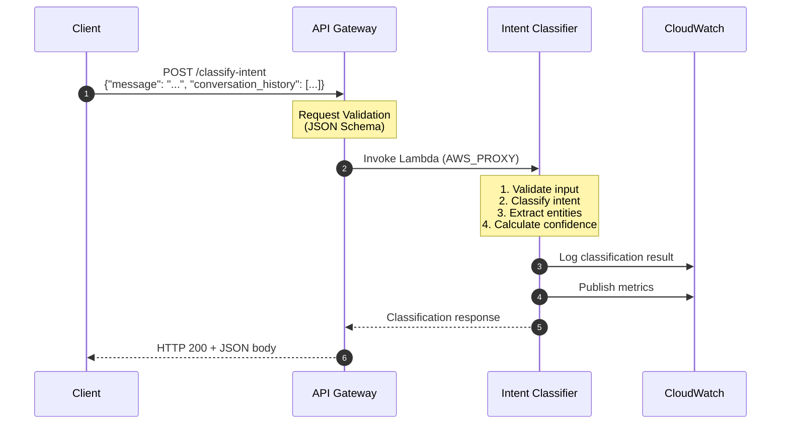

### Request/Response Format

**Request:**

```json
{
  "message": "I need to speak to a manager about order #ABC-12345",
  "conversation_history": [
    {"role": "user", "content": "Hello"},
    {"role": "assistant", "content": "Hi! How can I help you today?"}
  ]
}
```

**Response:**

```json
{
  "message": "Intent classified successfully",
  "classification": {
    "intent": "escalation",
    "confidence": 0.85,
    "requires_context": true,
    "entities": {
      "order_id": "ABC-12345",
      "sentiment": "negative",
      "urgency": "high"
    }
  },
  "correlation_id": "550e8400-e29b-41d4-a716-446655440000"
}
```

---

## Context Building Flow

### Sequence Diagram

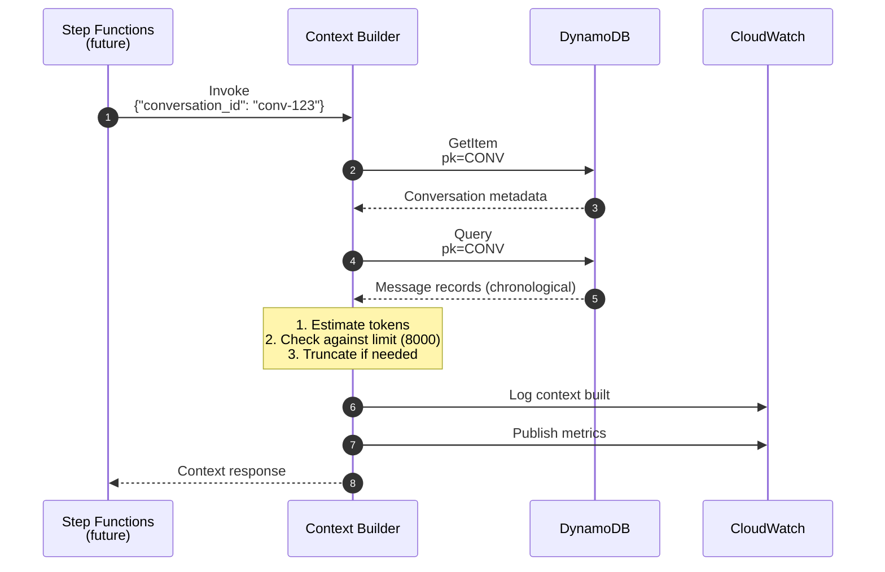

### Request/Response Format

**Request:**

```json
{
  "conversation_id": "conv-123",
  "include_system_prompt": true
}
```

**Response:**

```json
{
  "conversation_id": "conv-123",
  "context": {
    "conversation_id": "conv-123",
    "user_id": "user-456",
    "status": "ACTIVE",
    "last_intent": "question",
    "messages": [
      {
        "role": "USER",
        "content": "Hello, I need help",
        "timestamp": "2025-01-01T10:00:00Z"
      },
      {
        "role": "ASSISTANT",
        "content": "Hi! How can I help you today?",
        "timestamp": "2025-01-01T10:02:00Z"
      }
    ],
    "total_messages": 2,
    "estimated_tokens": 45,
    "is_truncated": false
  },
  "timestamp": "2025-01-01T10:05:00Z"
}
```

---

## DynamoDB Access Patterns

### Entity Relationships

```mermaid
erDiagram
    CONVERSATION ||--o{ MESSAGE : contains
    USER ||--o{ CONVERSATION : has

    CONVERSATION {
        string pk PK
        string sk SK
        string conversation_id
        string user_id
        string status
        int message_count
        string last_intent
        int ttl
    }

    MESSAGE {
        string pk FK
        string sk SK
        string message_id
        string role
        string content
        string intent
        int ttl
    }

    USER {
        string pk PK
        string sk SK
        string email
        int total_conversations
    }
```

**Key Patterns:**

- `CONVERSATION`: pk = `CONV#{conversation_id}`, sk = `METADATA`
- `MESSAGE`: pk = `CONV#{conversation_id}`, sk = `MSG#{timestamp}#{message_id}`
- `USER`: pk = `USER#{user_id}`, sk = `PROFILE`

### Access Pattern Flows

#### Pattern 1: Get Conversation Metadata

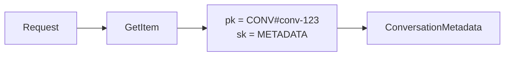

#### Pattern 2: Get Messages (Chronological)

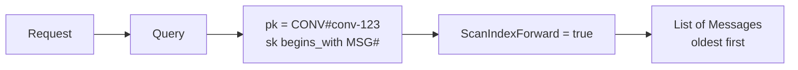

#### Pattern 3: Get User's Conversations

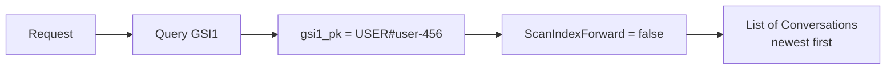

#### Pattern 4: Get Escalated Conversations

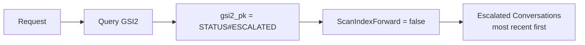

---

## Token Management Flow

### Context Window Management

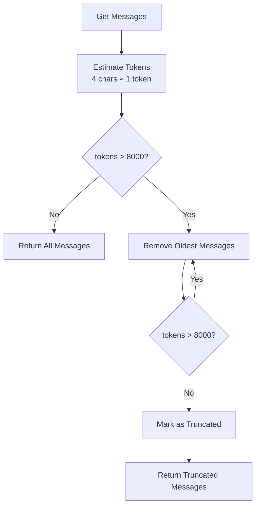

### Token Estimation Example

```markdown
Message: "Hello, I need help with my order"
Characters: 34
Estimated Tokens: 34 / 4 = 8.5 ≈ 9 tokens

Context Window Limit: 8000 tokens
Typical message: ~50 tokens
Max messages before truncation: ~160 messages
```

---

## Future: Full Conversation Flow

### End-to-End Flow (Target State)

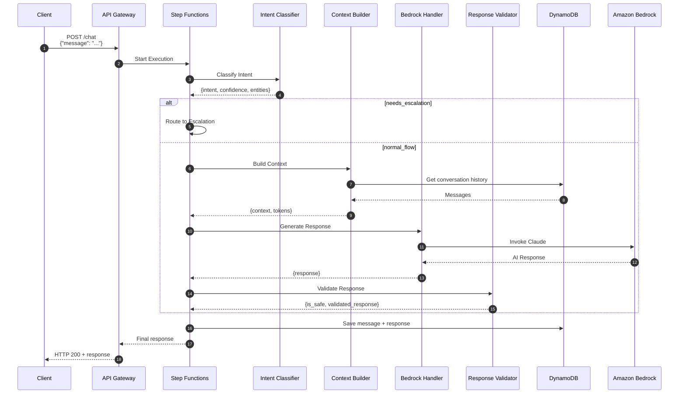

### State Machine Definition

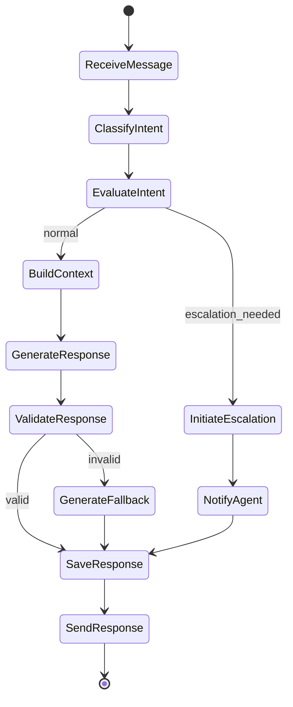

---

## Error Handling Flows

### Validation Error

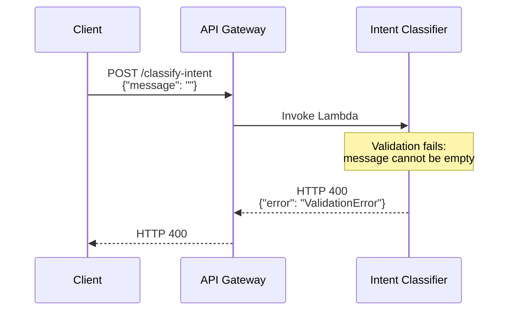

### DynamoDB Error

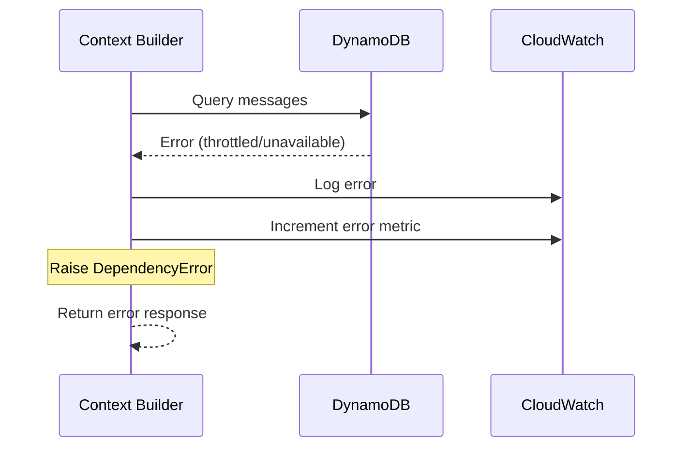

---

## Observability Data Flow

### Logging Flow

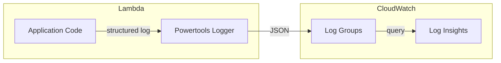

### Metrics Flow

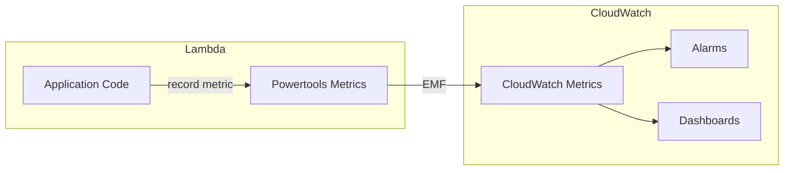

### Tracing Flow

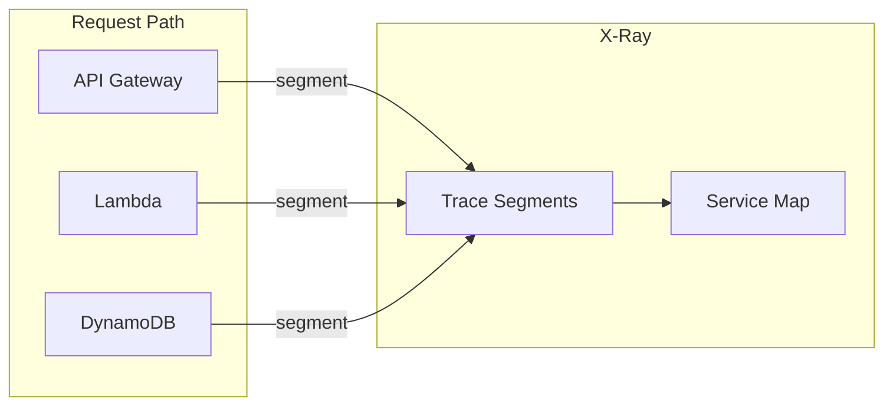

---

## Related Documentation

- [System Design](./system-design.md) — Overall architecture
- [ADR-008: DynamoDB Schema](../adr/008-dynamodb-schema-design.md) — Schema details
- [Build & Deploy Architecture](../build-deploy-architecture.md) — Deployment flows
