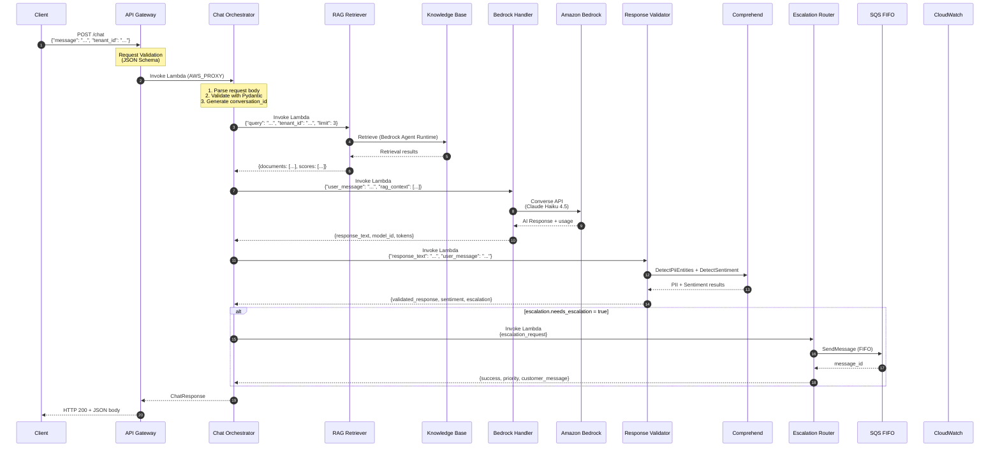
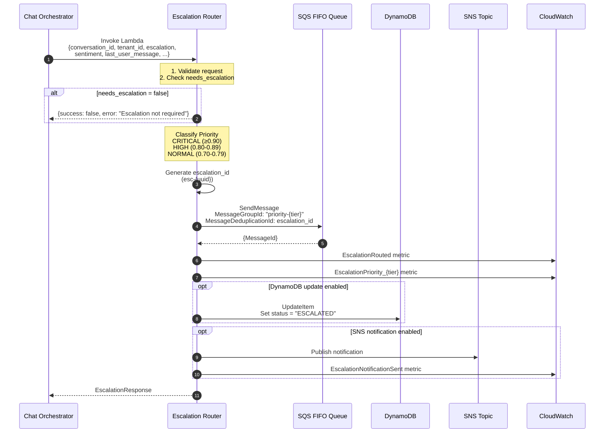
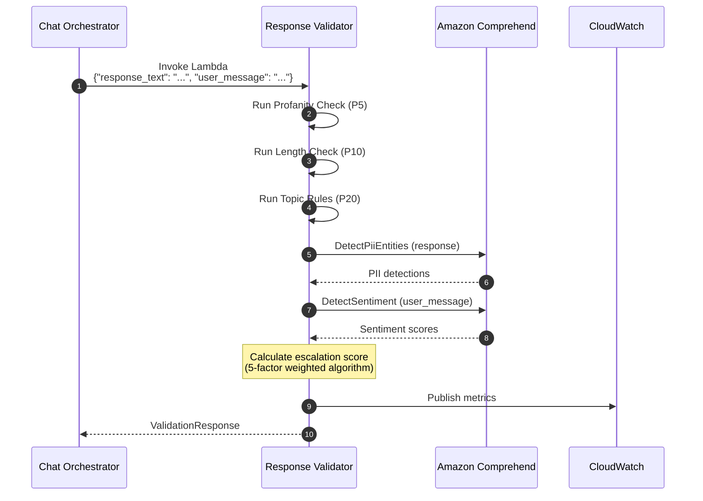
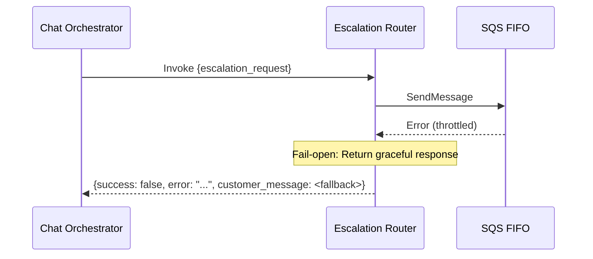

# Data Flow

**Last Updated:** December 30, 2025
**Status:** Phase 3.3 Complete

---

## Overview

This document describes the data flows within the AI Customer Service Bot, focusing on how customer messages are processed,
how RAG retrieval works, how AI responses are generated, how responses are validated for safety and compliance,
how sentiment analysis and escalation scoring work, and how escalated conversations are routed to human agents.

---

## Chat Flow (Primary)

### Sequence Diagram



---

## Escalation Router Flow

### Overview

The Escalation Router is invoked by the Chat Orchestrator when the escalation score exceeds the threshold (default 0.70).
It routes the conversation to human agents via SQS FIFO queues with priority-based ordering.

### Sequence Diagram



### Request/Response Format

**Request (Chat Orchestrator → Escalation Router):**

```json
{
  "conversation_id": "conv-abc123",
  "tenant_id": "tenant-456",
  "user_id": "user-789",
  "escalation": {
    "score": 0.82,
    "needs_escalation": true,
    "threshold": 0.70,
    "factors": {
      "explicit_intent": 1.0,
      "negative_sentiment": 0.88,
      "urgency": 0.5,
      "repeated_question": 0.0,
      "low_confidence": 0.0
    },
    "primary_reason": "explicit_intent"
  },
  "sentiment": {
    "sentiment": "NEGATIVE",
    "confidence": 0.88,
    "negative_score": 0.88
  },
  "last_user_message": "I want to speak to a human agent right now!",
  "last_ai_response": "I understand your concern...",
  "message_count": 5,
  "intent": "escalation",
  "urgency": "high"
}
```

**Response (Success):**

```json
{
  "success": true,
  "escalation_id": "esc-ce5359a1ce2b",
  "priority": "HIGH",
  "queue_message_id": "c83d7d7f-e71e-490e-a9d9-2bd64ffa9fd1",
  "notification_sent": false,
  "customer_message": "I understand your concern, and I want to make sure you get the help you need. I've escalated this to our support team, and a human agent will assist you shortly.",
  "estimated_wait": "< 5 minutes",
  "processed_at": "2025-12-30T02:59:17.650809"
}
```

### SQS Queue Message Format

```json
{
  "escalation_id": "esc-ce5359a1ce2b",
  "conversation_id": "conv-abc123",
  "tenant_id": "tenant-456",
  "user_id": "user-789",
  "priority": "HIGH",
  "escalation_score": 0.82,
  "primary_reason": "explicit_intent",
  "escalation_factors": {
    "explicit_intent": 1.0,
    "negative_sentiment": 0.88,
    "urgency": 0.5,
    "repeated_question": 0.0,
    "low_confidence": 0.0
  },
  "sentiment": {
    "sentiment": "NEGATIVE",
    "confidence": 0.88,
    "negative_score": 0.88
  },
  "context": {
    "last_user_message": "I want to speak to a human agent right now!",
    "last_ai_response": "I understand your concern...",
    "message_count": 5,
    "intent": "escalation",
    "urgency": "high"
  },
  "queued_at": "2025-12-30T02:59:17.650809Z"
}
```

### Priority Classification

| Priority | Score Range | Wait Time | Message Group |
| ---------- | ------------- | ----------- | --------------- |
| CRITICAL | ≥ 0.90 | < 2 minutes | priority-critical |
| HIGH | 0.80 - 0.89 | < 5 minutes | priority-high |
| NORMAL | 0.70 - 0.79 | < 10 minutes | priority-normal |

### Customer Messages by Priority

| Priority | Customer Message |
| ---------- | ------------------ |
| CRITICAL | "I completely understand your frustration, and I sincerely apologize. I've immediately escalated this to a senior support specialist who will contact you within the next few minutes. Your case is our top priority." |
| HIGH | "I understand your concern, and I want to make sure you get the help you need. I've escalated this to our support team, and a human agent will assist you shortly." |
| NORMAL | "I've noted your request and escalated this to our support team. A human agent will be with you soon. Is there anything else I can help with?" |

---

## Response Validation Flow

### Sequence Diagram



### Escalation Score Calculation

```bash
score = (0.35 × explicit_intent) +
        (0.25 × negative_sentiment) +
        (0.20 × urgency) +
        (0.15 × repeated_question) +
        (0.05 × low_confidence)

needs_escalation = (score >= 0.70)
```

### Factor Details

| Factor | Weight | Scoring |
| -------- | -------- | --------- |
| Explicit Intent | 0.35 | 1.0 if pattern matched, else 0.0 |
| Negative Sentiment | 0.25 | Direct Comprehend negative score |
| Urgency | 0.20 | high=1.0, medium=0.5, low=0.0 |
| Repeated Question | 0.15 | 2+ repeats=1.0, 1=0.5, 0=0.0 |
| Low Confidence | 0.05 | (1.0 - confidence) if < 0.70 |

---

## Error Handling (Fail-Open Design)

### Escalation Router Error



---

## Metrics

| Metric | Source | Description |
| -------- | -------- | ------------- |
| EscalationRouted | Escalation Router | Conversations routed to agents |
| EscalationPriority_CRITICAL | Escalation Router | Critical priority escalations |
| EscalationPriority_HIGH | Escalation Router | High priority escalations |
| EscalationPriority_NORMAL | Escalation Router | Normal priority escalations |
| EscalationQueueLatency | Escalation Router | Time to queue message |
| EscalationNotificationSent | Escalation Router | SNS notifications sent |
| EscalationError | Escalation Router | Routing errors |
| EscalationTriggered | Response Validator | Escalation threshold exceeded |
| SentimentAnalysisRequests | Response Validator | Sentiment analysis calls |
| ValidationCount | Response Validator | Total validations |

---

## Related Documentation

- [System Design](./system-design.md) — Overall architecture
- [ADR-013: Sentiment Analysis & Escalation](../adr/ADR-013-sentiment-escalation.md) — Scoring design
- [ADR-014: Escalation Router](../adr/ADR-014-escalation-router.md) — Routing design
