# Data Flow

**Last Updated:** December 28, 2025
**Status:** Phase 3.2 Complete

---

## Overview

This document describes the data flows within the AI Customer Service Bot, focusing on how customer messages are processed, how RAG retrieval works, how AI responses are generated, how responses
are validated for safety and compliance, and how sentiment analysis and escalation scoring work.

---

## Chat Flow (Primary)

### Sequence Diagram

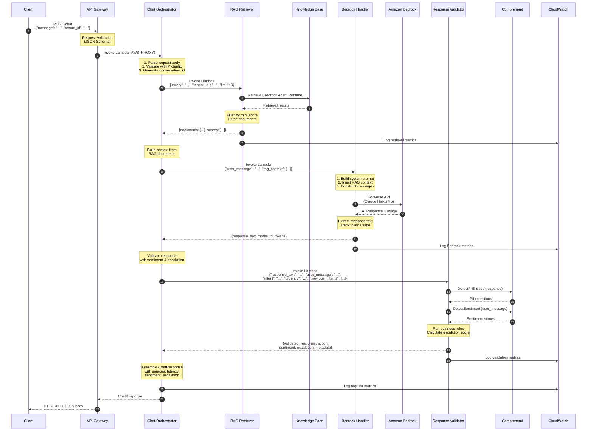

### Request/Response Format

**Request:**

```json
{
  "message": "How do I reset my password?",
  "tenant_id": "acme-corp",
  "conversation_id": "conv-abc123",
  "use_rag": true,
  "validate_response": true,
  "rag_options": {
    "top_k": 3,
    "min_score": 0.5
  }
}
```

**Response:**

```json
{
  "conversation_id": "conv-abc123",
  "message_id": "msg-xyz789",
  "response": "To reset your password, click 'Forgot Password' on the login page...",
  "sources": [
    {
      "source_name": "general-faqs.md",
      "content": "### How do I reset my password?\nClick 'Forgot Password'...",
      "source_uri": "s3://bucket/faqs/general-faqs.md",
      "score": 0.85,
      "metadata": {}
    }
  ],
  "metadata": {
    "model": "us.anthropic.claude-haiku-4-5-20251001-v1:0",
    "rag_documents_used": 3,
    "rag_skipped": false,
    "latency": {
      "rag_ms": 1200.5,
      "bedrock_ms": 2500.3,
      "validation_ms": 250.2,
      "total_ms": 3950.0
    },
    "validation": {
      "is_valid": true,
      "action": "PASS",
      "was_modified": false,
      "validation_skipped": false,
      "rules_evaluated": 3,
      "fallback_used": false,
      "fallback_reason": null
    },
    "sentiment": {
      "sentiment": "NEUTRAL",
      "confidence": 0.85,
      "negative_score": 0.05
    },
    "escalation": {
      "score": 0.15,
      "needs_escalation": false,
      "threshold": 0.70,
      "primary_reason": null,
      "explicit_intent_score": 0.0,
      "negative_sentiment_score": 0.05,
      "urgency_score": 0.0,
      "repeated_question_score": 0.0,
      "low_confidence_score": 0.0
    }
  }
}
```

---

## Response Validation Flow

### Overview

The Response Validator is invoked by the Chat Orchestrator after Bedrock generates a response.
It validates the response, analyzes sentiment, calculates escalation score, and returns either the original, modified, or a fallback response.

### Sequence Diagram

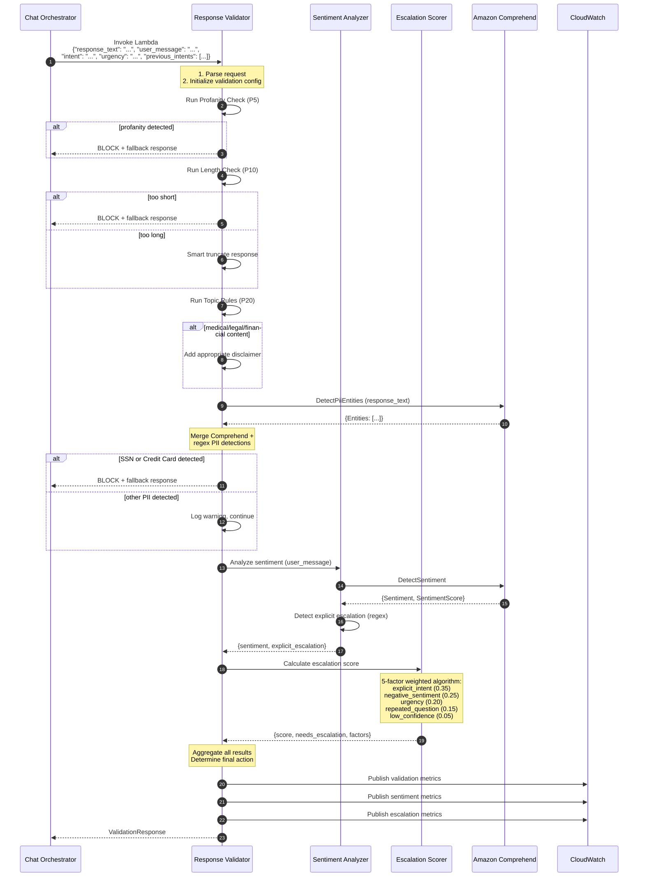

### Request/Response Format

**Request (Chat Orchestrator → Response Validator):**

```json
{
  "response_text": "AI-generated response text...",
  "user_message": "Original user question",
  "conversation_id": "conv-abc123",
  "tenant_id": "tenant-456",
  "intent": "question",
  "intent_confidence": 0.92,
  "urgency": "low",
  "message_count": 3,
  "previous_intents": ["greeting", "question"],
  "options": {
    "check_pii": true,
    "check_profanity": true,
    "check_business_rules": true,
    "analyze_sentiment": true,
    "calculate_escalation": true
  }
}
```

### Response Scenario A: Valid Response (PASS)

```json
{
  "is_valid": true,
  "action": "PASS",
  "validated_response": "Original response unchanged",
  "original_response": "Original response unchanged",
  "was_modified": false,
  "validation_results": {
    "pii": { "passed": true, "detections": [], "blocked_types": [], "redacted_count": 0 },
    "profanity": { "passed": true, "detected_terms": [], "severity": null },
    "length": { "passed": true, "char_count": 150, "min_length": 20, "max_length": 2000, "was_truncated": false },
    "business_rules": { "passed": true, "violations": [], "rules_evaluated": 3, "disclaimer_added": false }
  },
  "sentiment": {
    "sentiment": "NEUTRAL",
    "confidence": 0.85,
    "scores": {
      "positive": 0.10,
      "negative": 0.05,
      "neutral": 0.85,
      "mixed": 0.00
    }
  },
  "escalation": {
    "score": 0.15,
    "needs_escalation": false,
    "threshold": 0.70,
    "factors": {
      "explicit_intent": 0.0,
      "negative_sentiment": 0.05,
      "urgency": 0.0,
      "repeated_question": 0.0,
      "low_confidence": 0.0
    },
    "primary_reason": null
  },
  "metadata": {
    "validation_time_ms": 250.5,
    "rules_evaluated": 3,
    "comprehend_calls": 2,
    "fallback_used": false,
    "fallback_reason": null,
    "timestamp": "2025-12-27T10:30:00Z"
  }
}
```

### Response Scenario B: Escalation Triggered

```json
{
  "is_valid": true,
  "action": "PASS",
  "validated_response": "I understand your frustration. Let me help you.",
  "original_response": "I understand your frustration. Let me help you.",
  "was_modified": false,
  "validation_results": {
    "pii": { "passed": true, "detections": [], "blocked_types": [], "redacted_count": 0 },
    "profanity": { "passed": true, "detected_terms": [], "severity": null },
    "length": { "passed": true, "char_count": 50, "min_length": 20, "max_length": 2000, "was_truncated": false },
    "business_rules": { "passed": true, "violations": [], "rules_evaluated": 3, "disclaimer_added": false }
  },
  "sentiment": {
    "sentiment": "NEGATIVE",
    "confidence": 0.88,
    "scores": {
      "positive": 0.02,
      "negative": 0.88,
      "neutral": 0.05,
      "mixed": 0.05
    }
  },
  "escalation": {
    "score": 0.78,
    "needs_escalation": true,
    "threshold": 0.70,
    "factors": {
      "explicit_intent": 1.0,
      "negative_sentiment": 0.88,
      "urgency": 1.0,
      "repeated_question": 0.5,
      "low_confidence": 0.0
    },
    "primary_reason": "Explicit escalation request"
  },
  "metadata": {
    "validation_time_ms": 280.0,
    "rules_evaluated": 3,
    "comprehend_calls": 2,
    "fallback_used": false,
    "fallback_reason": null,
    "timestamp": "2025-12-27T10:30:00Z"
  }
}
```

### Response Scenario C: Blocked Response (BLOCK)

```json
{
  "is_valid": false,
  "action": "BLOCK",
  "validated_response": "I apologize, but I'm unable to provide that information. Please contact our support team for assistance.",
  "original_response": "Your SSN is 123-45-6789...",
  "was_modified": true,
  "validation_results": {
    "pii": {
      "passed": false,
      "detections": [
        { "pii_type": "SSN", "action": "BLOCK", "confidence": 0.99, "start": 12, "end": 23 }
      ],
      "blocked_types": ["SSN"],
      "redacted_count": 0
    },
    "profanity": { "passed": true, "detected_terms": [], "severity": null },
    "length": { "passed": true, "char_count": 30, "min_length": 20, "max_length": 2000, "was_truncated": false },
    "business_rules": { "passed": true, "violations": [], "rules_evaluated": 3, "disclaimer_added": false }
  },
  "sentiment": null,
  "escalation": null,
  "metadata": {
    "validation_time_ms": 200.0,
    "rules_evaluated": 3,
    "comprehend_calls": 1,
    "fallback_used": true,
    "fallback_reason": "pii_blocked",
    "timestamp": "2025-12-27T10:30:00Z"
  }
}
```

### Validation Pipeline Internal Flow

```mermaid
flowchart TB
    subgraph Response Validator Lambda
        IN[Request] --> PARSE[Parse & Validate Input]
        PARSE --> INIT[Initialize Config from Env]

        INIT --> PROF{Profanity Check}
        PROF -->|fail| BLOCK_PROF[BLOCK: Profanity]
        PROF -->|pass| LEN{Length Check}

        LEN -->|too short| BLOCK_LEN[BLOCK: Too Short]
        LEN -->|too long| TRUNC[Truncate Response]
        LEN -->|ok| TOPIC
        TRUNC --> TOPIC

        TOPIC{Topic Rules} -->|medical/legal/financial| DISCLAIM[Add Disclaimer]
        TOPIC -->|ok| PII
        DISCLAIM --> PII

        PII[PII Detection] --> COMPREHEND_PII[Call Comprehend DetectPiiEntities]
        COMPREHEND_PII --> REGEX[Run Regex Patterns]
        REGEX --> MERGE[Merge Detections]

        MERGE --> PII_CHECK{Critical PII?}
        PII_CHECK -->|SSN/CC| BLOCK_PII[BLOCK: PII]
        PII_CHECK -->|other/none| SENTIMENT[Sentiment Analysis]

        BLOCK_PROF --> FALLBACK[Use Fallback Response]
        BLOCK_LEN --> FALLBACK
        BLOCK_PII --> FALLBACK

        SENTIMENT --> COMPREHEND_SENT[Call Comprehend DetectSentiment]
        COMPREHEND_SENT --> EXPLICIT[Detect Explicit Escalation]
        EXPLICIT --> ESCALATION[Calculate Escalation Score]

        subgraph Escalation Scorer
            ESCALATION --> FACTOR1[Explicit Intent: 0.35]
            ESCALATION --> FACTOR2[Negative Sentiment: 0.25]
            ESCALATION --> FACTOR3[Urgency: 0.20]
            ESCALATION --> FACTOR4[Repeated Question: 0.15]
            ESCALATION --> FACTOR5[Low Confidence: 0.05]
            FACTOR1 --> WEIGHTED[Weighted Sum]
            FACTOR2 --> WEIGHTED
            FACTOR3 --> WEIGHTED
            FACTOR4 --> WEIGHTED
            FACTOR5 --> WEIGHTED
            WEIGHTED --> THRESHOLD{Score >= 0.70?}
            THRESHOLD -->|yes| NEEDS_ESC[needs_escalation: true]
            THRESHOLD -->|no| NO_ESC[needs_escalation: false]
        end

        NEEDS_ESC --> AGG[Aggregate Results]
        NO_ESC --> AGG
        FALLBACK --> AGG

        AGG --> ACTION[Determine Final Action]
        ACTION --> METRICS[Publish Metrics]
        METRICS --> OUT[Return Response]
    end
```

### Data Transformation

| Stage | Input | Output | Transformation |
| ------- | ------- | -------- | ---------------- |
| Parse | Lambda Event | ValidationRequest | JSON → Pydantic model |
| Profanity | Response text | ProfanityResult | Text → detected terms |
| Length | Response text | LengthResult | Text → char count, truncation |
| Topics | Response text | TopicResult | Text → disclaimer if needed |
| PII Detection | Response text | PIICheckResult | Text → PII entities |
| Sentiment | User message | SentimentResult | Text → sentiment scores |
| Escalation | Multiple factors | EscalationResult | Factors → weighted score |
| Aggregation | All results | ValidationResponse | Determine final action |
| Response | ValidationResponse | Lambda Response | Pydantic → JSON |

---

## Sentiment Analysis Flow

### Overview

Sentiment analysis is performed on the **user message** (not the AI response) to understand customer emotion and contribute to escalation scoring.

### Sequence Diagram

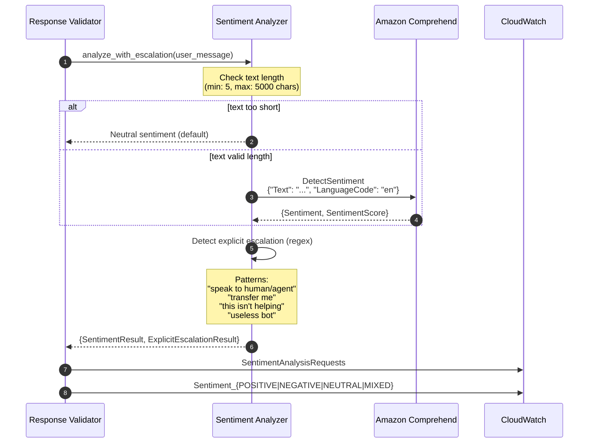

### Sentiment Result Structure

```json
{
  "sentiment": "NEGATIVE",
  "confidence": 0.88,
  "scores": {
    "positive": 0.02,
    "negative": 0.88,
    "neutral": 0.05,
    "mixed": 0.05
  }
}
```

### Explicit Escalation Patterns

| Pattern | Example Matches |
| --------- | ----------------- |
| `speak/talk to human/agent/person` | "I want to speak to a human" |
| `need/want human/agent` | "I need a human agent" |
| `transfer/connect/escalate to support` | "Transfer me to support" |
| `real person` | "Can I talk to a real person?" |
| `this isn't helping/working` | "This isn't helping at all" |
| `useless/stupid bot` | "This useless bot" |
| `stop talking to bot` | "I want to stop talking to this bot" |

---

## Escalation Scoring Flow

### Overview

Escalation scoring calculates a weighted score from 5 factors to determine if the conversation should be escalated to a human agent.

### Sequence Diagram

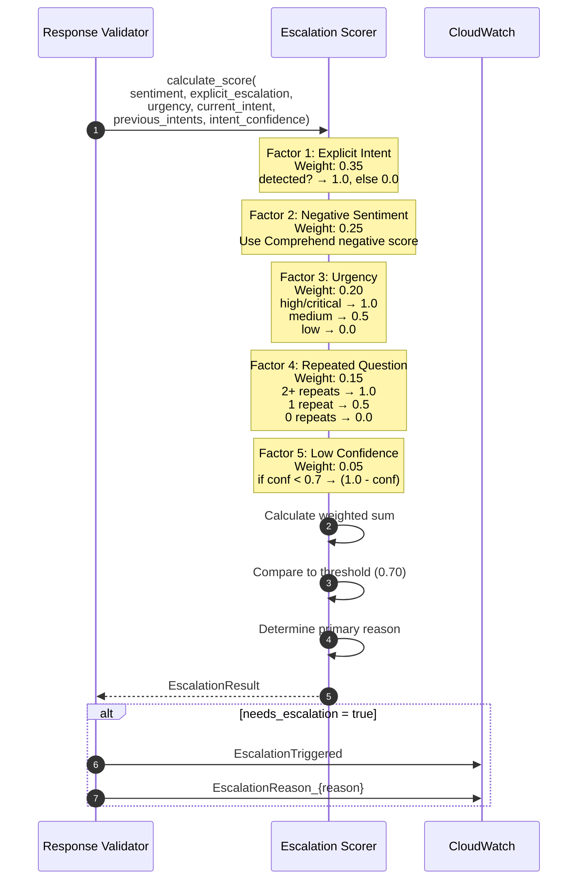

### Escalation Score Calculation

```bash
score = (0.35 × explicit_intent) +
        (0.25 × negative_sentiment) +
        (0.20 × urgency) +
        (0.15 × repeated_question) +
        (0.05 × low_confidence)

needs_escalation = (score >= threshold)
```

### Factor Details

| Factor | Weight | Input | Scoring |
| -------- | -------- | ------- | --------- |
| Explicit Intent | 0.35 | Regex detection | 1.0 if pattern matched, else 0.0 |
| Negative Sentiment | 0.25 | Comprehend score | Direct negative score (0.0-1.0) |
| Urgency | 0.20 | Intent classifier | high=1.0, medium=0.5, low=0.0 |
| Repeated Question | 0.15 | previous_intents | Count of current_intent in history |
| Low Confidence | 0.05 | intent_confidence | (1.0 - confidence) if < 0.7 |

### Escalation Result Structure

```json
{
  "score": 0.78,
  "needs_escalation": true,
  "threshold": 0.70,
  "factors": {
    "explicit_intent": 1.0,
    "negative_sentiment": 0.88,
    "urgency": 1.0,
    "repeated_question": 0.5,
    "low_confidence": 0.0
  },
  "primary_reason": "Explicit escalation request"
}
```

---

## RAG Retrieval Flow

### Sequence Diagram

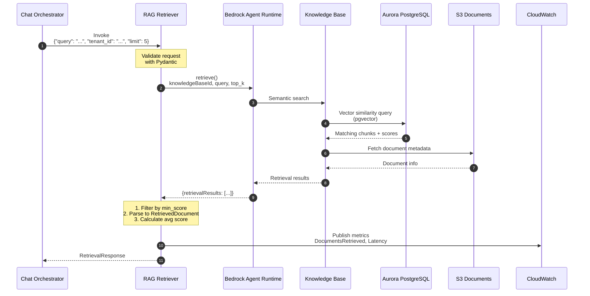

### Request/Response Format

**Request:**

```json
{
  "query": "How do I reset my password?",
  "tenant_id": "acme-corp",
  "top_k": 5,
  "min_score": 0.5,
  "retrieval_type": "SEMANTIC"
}
```

**Response:**

```json
{
  "documents": [
    {
      "content": "### How do I reset my password?\nClick 'Forgot Password'...",
      "score": 0.85,
      "source_uri": "s3://bucket/faqs/general-faqs.md",
      "source_name": "general-faqs.md",
      "metadata": {}
    }
  ],
  "query": "How do I reset my password?",
  "total_found": 5,
  "retrieval_time_ms": 1200.5
}
```

---

## Bedrock Handler Flow

### Sequence Diagram

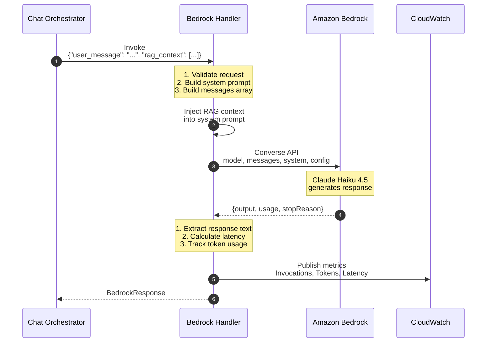

### Request/Response Format

**Request:**

```json
{
  "user_message": "How do I reset my password?",
  "rag_context": [
    "### How do I reset my password?\nClick 'Forgot Password' on the login page..."
  ],
  "conversation_id": "conv-abc123",
  "tenant_id": "acme-corp",
  "max_tokens": 1024,
  "temperature": 0.7
}
```

**Response:**

```json
{
  "conversation_id": "conv-abc123",
  "response_text": "To reset your password, follow these steps:\n1. Go to the login page...",
  "model_id": "us.anthropic.claude-haiku-4-5-20251001-v1:0",
  "input_tokens": 450,
  "output_tokens": 120,
  "latency_ms": 2500,
  "stop_reason": "end_turn",
  "timestamp": "2025-12-15T10:30:00Z"
}
```

---

## Intent Classification Flow

### Sequence Diagram

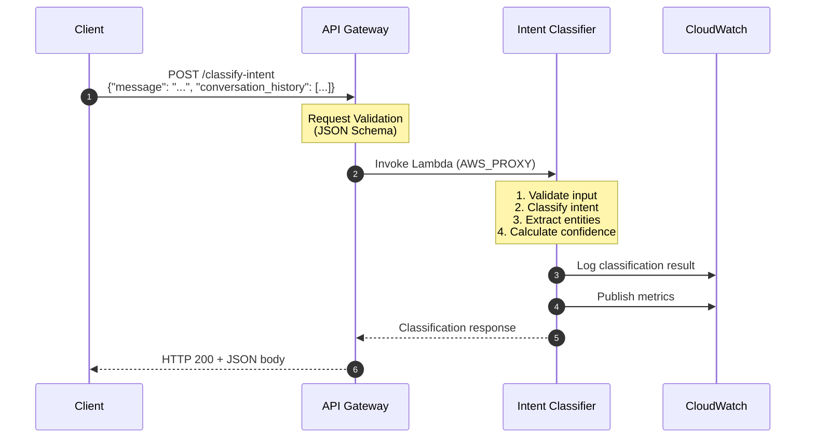

### Request/Response Format

**Request:**

```json
{
  "message": "I need to speak to a manager about order #ABC-12345",
  "conversation_history": [
    {"role": "user", "content": "Hello"},
    {"role": "assistant", "content": "Hi! How can I help you today?"}
  ]
}
```

**Response:**

```json
{
  "message": "Intent classified successfully",
  "classification": {
    "intent": "escalation",
    "confidence": 0.85,
    "requires_context": true,
    "entities": {
      "order_id": "ABC-12345",
      "sentiment": "negative",
      "urgency": "high"
    }
  },
  "correlation_id": "550e8400-e29b-41d4-a716-446655440000"
}
```

---

## Context Building Flow

### Sequence Diagram

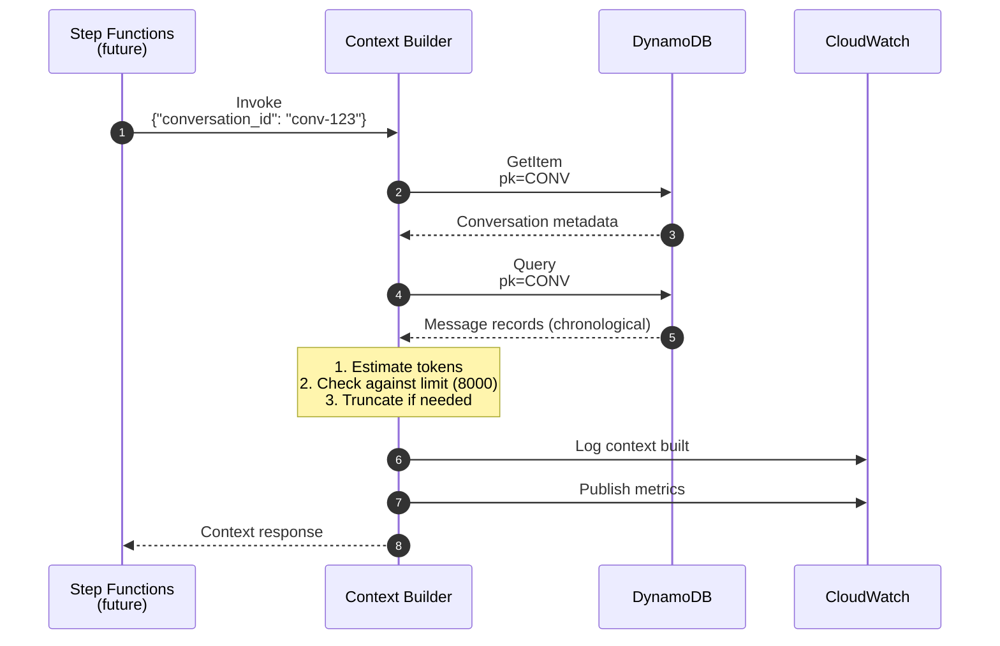

### Request/Response Format

**Request:**

```json
{
  "conversation_id": "conv-123",
  "include_system_prompt": true
}
```

**Response:**

```json
{
  "conversation_id": "conv-123",
  "context": {
    "conversation_id": "conv-123",
    "user_id": "user-456",
    "status": "ACTIVE",
    "last_intent": "question",
    "messages": [
      {
        "role": "USER",
        "content": "Hello, I need help",
        "timestamp": "2025-01-01T10:00:00Z"
      },
      {
        "role": "ASSISTANT",
        "content": "Hi! How can I help you today?",
        "timestamp": "2025-01-01T10:02:00Z"
      }
    ],
    "total_messages": 2,
    "estimated_tokens": 45,
    "is_truncated": false
  },
  "timestamp": "2025-01-01T10:05:00Z"
}
```

---

## DynamoDB Access Patterns

### Entity Relationships

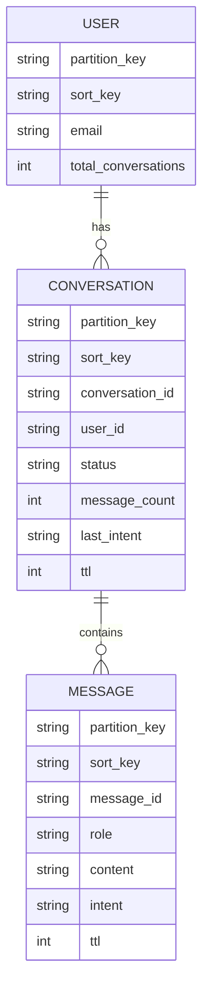

**Key Patterns:**

- `CONVERSATION`: partition_key = `CONV#{conversation_id}`, sort_key = `METADATA`
- `MESSAGE`: partition_key = `CONV#{conversation_id}`, sort_key = `MSG#{timestamp}#{message_id}`
- `USER`: partition_key = `USER#{user_id}`, sort_key = `PROFILE`

### Access Pattern Flows

#### Pattern 1: Get Conversation Metadata

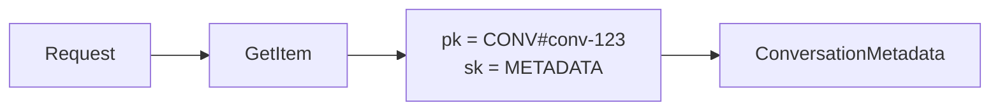

#### Pattern 2: Get Messages (Chronological)

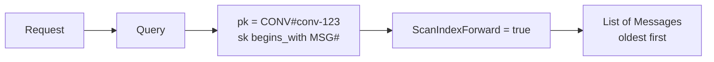

#### Pattern 3: Get User's Conversations

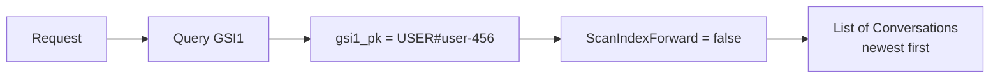

#### Pattern 4: Get Escalated Conversations

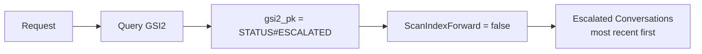

---

## Token Management Flow

### Context Window Management

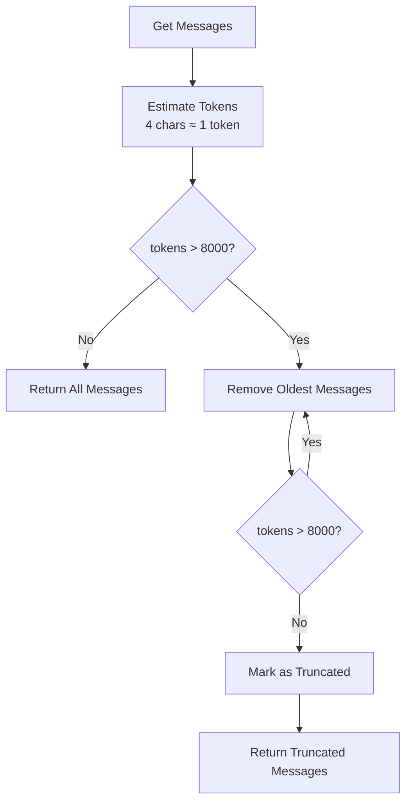

### Token Estimation Example

```markdown
Message: "Hello, I need help with my order"
Characters: 34
Estimated Tokens: 34 / 4 = 8.5 ≈ 9 tokens

Context Window Limit: 8000 tokens
Typical message: ~50 tokens
Max messages before truncation: ~160 messages
```

---

## Future: Step Functions Orchestration

### End-to-End Flow (Target State)

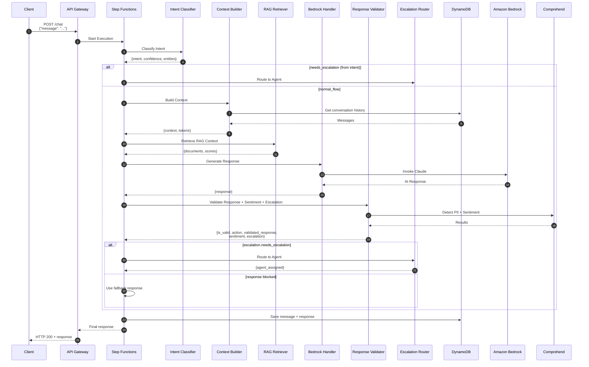

### State Machine Definition

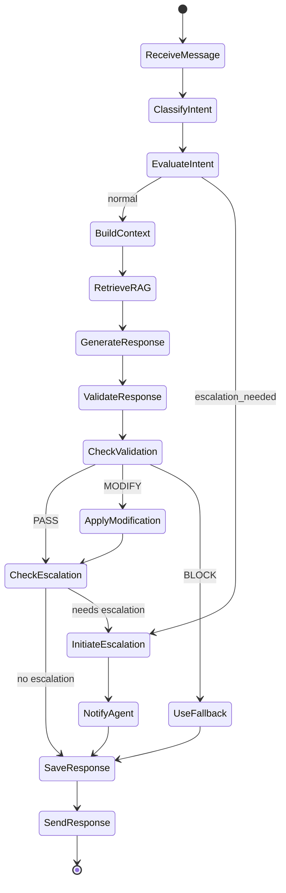

---

## Error Handling Flows

### Validation Error (Input)

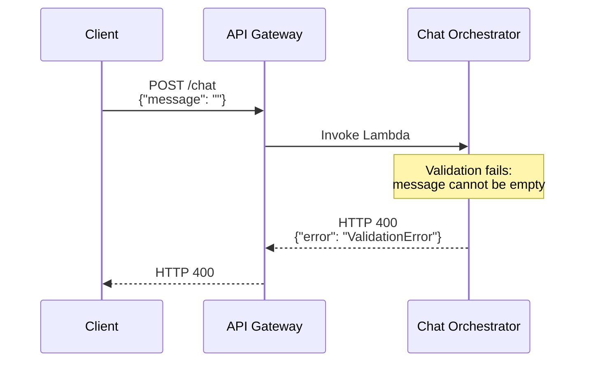

### RAG Retrieval Error (Non-Fatal)

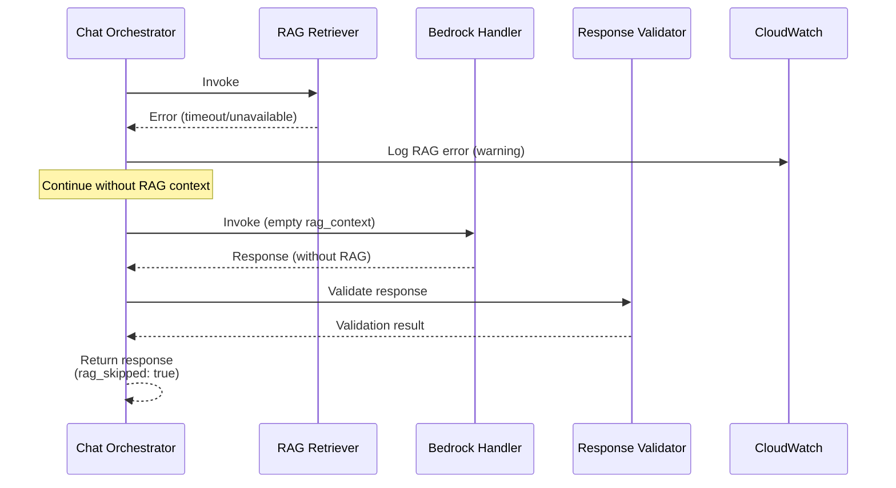

### Bedrock Error (Fatal)

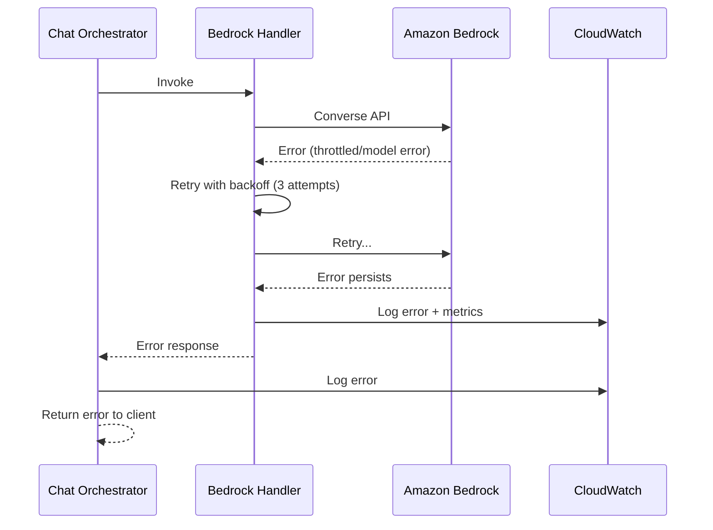

### Response Validation Error (Fail-Open)

```mermaid
sequenceDiagram
    participant CO as Chat Orchestrator
    participant RV as Response Validator
    participant CP as Comprehend
    participant CW as CloudWatch

    CO->>RV: Invoke<br/>{"response_text": "...", "user_message": "..."}

    RV->>CP: DetectPiiEntities
    CP-->>RV: Error (throttled/unavailable)

    Note over RV: FAIL_OPEN_ON_ERROR = true<br/>Return original response

    RV->>CW: Log error (warning)
    RV->>CW: Increment FallbackUsed metric

    RV-->>CO: {is_valid: true, action: "WARN",<br/>validated_response: <original>}

    Note over CO: Continue with original response<br/>(validation_error logged)
```

### Sentiment Analysis Error (Fail-Open)

```mermaid
sequenceDiagram
    participant RV as Response Validator
    participant SA as Sentiment Analyzer
    participant CP as Comprehend
    participant CW as CloudWatch

    RV->>SA: analyze_with_escalation(user_message)

    SA->>CP: DetectSentiment
    CP-->>SA: Error (throttled/unavailable)

    Note over SA: fail_open = true<br/>Return None for sentiment

    SA->>CW: Log error (warning)
    SA-->>RV: {sentiment: null, explicit_escalation}

    Note over RV: Continue without sentiment<br/>Escalation uses other factors
```

### Response Blocked (PII Detected)

```mermaid
sequenceDiagram
    participant CO as Chat Orchestrator
    participant RV as Response Validator
    participant CP as Comprehend
    participant CW as CloudWatch

    CO->>RV: Invoke<br/>{"response_text": "Your SSN is 123-45-6789"}

    RV->>RV: Run regex patterns
    Note over RV: SSN pattern matched

    RV->>CP: DetectPiiEntities
    CP-->>RV: {Entities: [{Type: "SSN", Score: 0.99}]}

    Note over RV: Critical PII detected<br/>Action: BLOCK<br/>Skip sentiment/escalation

    RV->>CW: Log PII detection
    RV->>CW: Increment PIIDetected metric
    RV->>CW: Increment ValidationBlocked metric

    RV-->>CO: {is_valid: false, action: "BLOCK",<br/>validated_response: <fallback>,<br/>sentiment: null, escalation: null}

    Note over CO: Use fallback response<br/>Original never sent to customer
```

### DynamoDB Error

```mermaid
sequenceDiagram
    participant CB as Context Builder
    participant DDB as DynamoDB
    participant CW as CloudWatch

    CB->>DDB: Query messages
    DDB-->>CB: Error (throttled/unavailable)

    CB->>CW: Log error
    CB->>CW: Increment error metric

    Note over CB: Raise DependencyError

    CB-->>CB: Return error response
```

---

## Observability Data Flow

### Logging Flow

```mermaid
flowchart LR
    subgraph Lambda
        CODE[Application Code]
        PT[Powertools Logger]
    end

    subgraph CloudWatch
        LOGS[Log Groups]
        INSIGHTS[Log Insights]
    end

    CODE -->|structured log| PT
    PT -->|JSON| LOGS
    LOGS -->|query| INSIGHTS
```

### Metrics Flow

```mermaid
flowchart LR
    subgraph Lambda
        CODE[Application Code]
        METRICS[Powertools Metrics]
    end

    subgraph CloudWatch
        CW_METRICS[CloudWatch Metrics]
        ALARMS[Alarms]
        DASH[Dashboards]
    end

    CODE -->|record metric| METRICS
    METRICS -->|EMF| CW_METRICS
    CW_METRICS --> ALARMS
    CW_METRICS --> DASH
```

### Tracing Flow

```mermaid
flowchart LR
    subgraph Request Path
        AG[API Gateway]
        CO[Chat Orchestrator]
        RR[RAG Retriever]
        BH[Bedrock Handler]
        RV[Response Validator]
    end

    subgraph X-Ray
        TRACES[Trace Segments]
        MAP[Service Map]
    end

    AG -->|segment| TRACES
    CO -->|segment| TRACES
    RR -->|segment| TRACES
    BH -->|segment| TRACES
    RV -->|segment| TRACES
    TRACES --> MAP
```

### Validation Metrics

| Metric | Unit | Description |
| -------- | ------ | ------------- |
| ValidationCount | Count | Total validation requests |
| ValidationBlocked | Count | Responses blocked |
| ValidationModified | Count | Responses modified |
| PIIDetected | Count | PII detection events |
| ProfanityDetected | Count | Profanity detection events |
| ValidationLatency | Milliseconds | Validation processing time |
| ComprehendCalls | Count | Comprehend API calls |
| FallbackUsed | Count | Fallback response used |
| SentimentAnalysisRequests | Count | Sentiment analysis calls |
| Sentiment_POSITIVE | Count | Positive sentiment detected |
| Sentiment_NEGATIVE | Count | Negative sentiment detected |
| Sentiment_NEUTRAL | Count | Neutral sentiment detected |
| Sentiment_MIXED | Count | Mixed sentiment detected |
| EscalationTriggered | Count | Escalation threshold exceeded |
| EscalationReason_* | Count | Escalation by primary reason |

---

## Related Documentation

- [System Design](./system-design.md) — Overall architecture
- [ADR-008: DynamoDB Schema](../adr/ADR-008-dynamodb-schema-design.md) — Schema details
- [ADR-009: Bedrock Integration](../adr/ADR-009-bedrock-integration.md) — Bedrock design
- [ADR-010: Knowledge Base RAG](../adr/ADR-010-knowledge-base-rag.md) — RAG architecture
- [ADR-011: Orchestrator Pattern](../adr/ADR-011-orchestrator-pattern.md) — Orchestration design
- [ADR-012: Response Validation Strategy](../adr/ADR-012-response-validation.md) — Validation design
- [ADR-013: Sentiment Analysis & Escalation](../adr/ADR-013-sentiment-escalation.md) — Sentiment & escalation design
- [Build & Deploy Architecture](../build-deploy-architecture.md) — Deployment flows
