# Data Flow

**Last Updated:** December 17, 2025
**Status:** Phase 2 Complete

---

## Overview

This document describes the data flows within the AI Customer Service Bot, focusing on how customer messages are processed, how RAG retrieval works, and how AI responses are generated.

---

## Chat Flow (Primary)

### Sequence Diagram

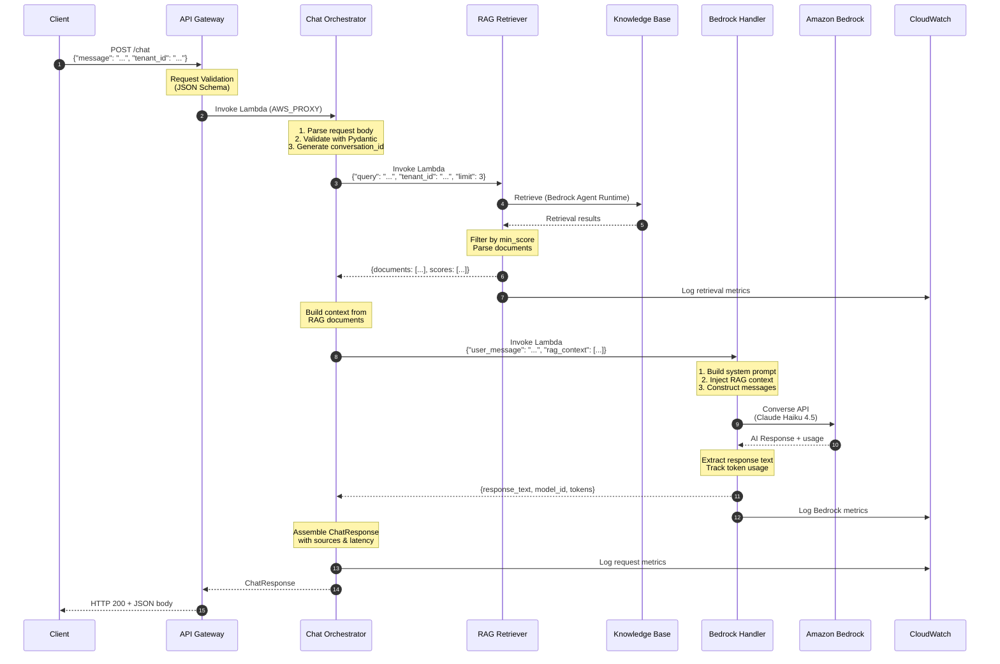

### Request/Response Format

**Request:**

```json
{
  "message": "How do I reset my password?",
  "tenant_id": "acme-corp",
  "conversation_id": "conv-abc123",
  "use_rag": true,
  "rag_options": {
    "top_k": 3,
    "min_score": 0.5
  }
}
```

**Response:**

```json
{
  "conversation_id": "conv-abc123",
  "message_id": "msg-xyz789",
  "response": "To reset your password, click 'Forgot Password' on the login page...",
  "sources": [
    {
      "source_name": "general-faqs.md",
      "content": "### How do I reset my password?\nClick 'Forgot Password'...",
      "source_uri": "s3://bucket/faqs/general-faqs.md",
      "score": 0.85,
      "metadata": {}
    }
  ],
  "metadata": {
    "model": "us.anthropic.claude-haiku-4-5-20251001-v1:0",
    "rag_documents_used": 3,
    "rag_skipped": false,
    "latency": {
      "rag_ms": 1200.5,
      "bedrock_ms": 2500.3,
      "total_ms": 3700.8
    }
  }
}
```

---

## RAG Retrieval Flow

### Sequence Diagram

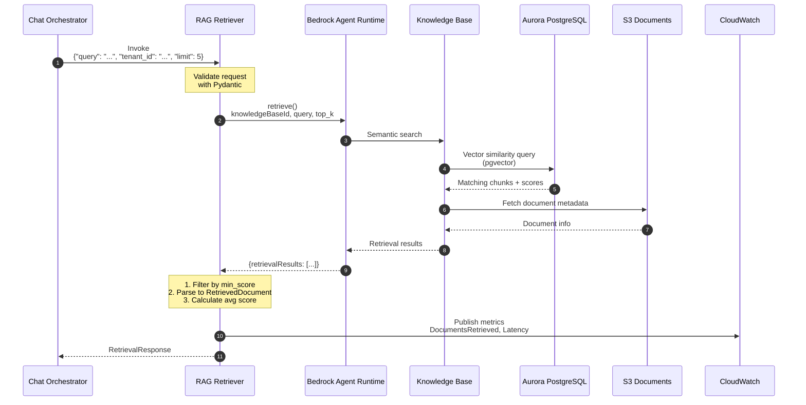

### Request/Response Format

**Request:**

```json
{
  "query": "How do I reset my password?",
  "tenant_id": "acme-corp",
  "top_k": 5,
  "min_score": 0.5,
  "retrieval_type": "SEMANTIC"
}
```

**Response:**

```json
{
  "documents": [
    {
      "content": "### How do I reset my password?\nClick 'Forgot Password'...",
      "score": 0.85,
      "source_uri": "s3://bucket/faqs/general-faqs.md",
      "source_name": "general-faqs.md",
      "metadata": {}
    }
  ],
  "query": "How do I reset my password?",
  "total_found": 5,
  "retrieval_time_ms": 1200.5
}
```

---

## Bedrock Handler Flow

### Sequence Diagram

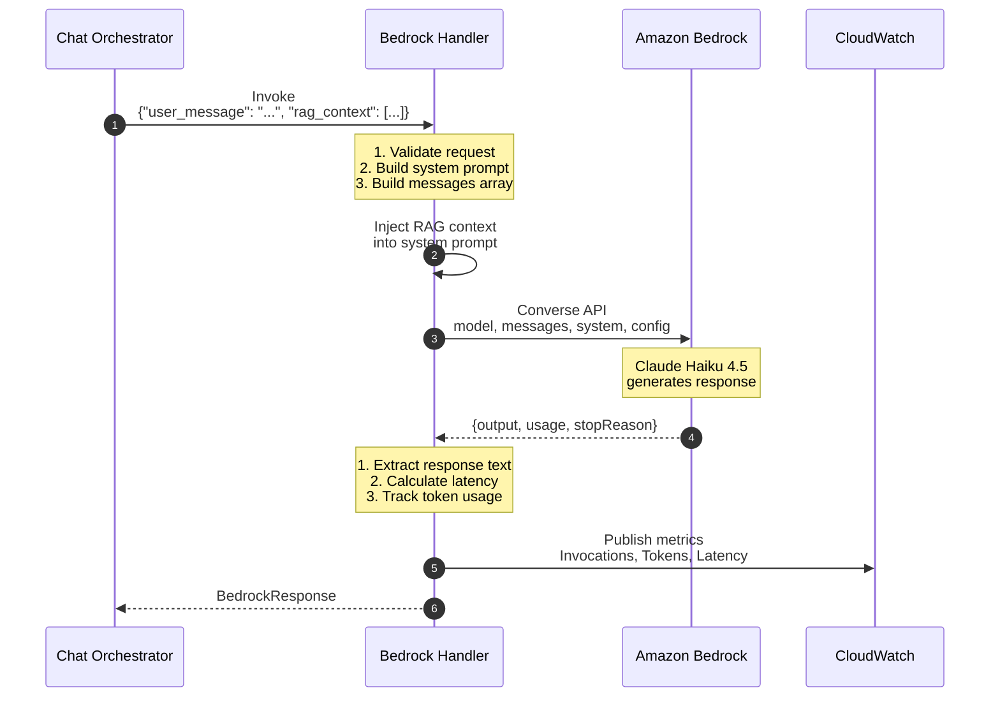

### Request/Response Format

**Request:**

```json
{
  "user_message": "How do I reset my password?",
  "rag_context": [
    "### How do I reset my password?\nClick 'Forgot Password' on the login page..."
  ],
  "conversation_id": "conv-abc123",
  "tenant_id": "acme-corp",
  "max_tokens": 1024,
  "temperature": 0.7
}
```

**Response:**

```json
{
  "conversation_id": "conv-abc123",
  "response_text": "To reset your password, follow these steps:\n1. Go to the login page...",
  "model_id": "us.anthropic.claude-haiku-4-5-20251001-v1:0",
  "input_tokens": 450,
  "output_tokens": 120,
  "latency_ms": 2500,
  "stop_reason": "end_turn",
  "timestamp": "2025-12-15T10:30:00Z"
}
```

---

## Intent Classification Flow

### Sequence Diagram

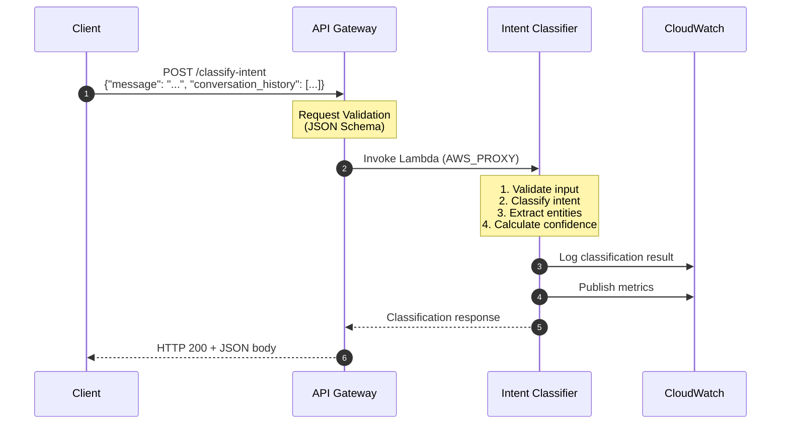

### Request/Response Format

**Request:**

```json
{
  "message": "I need to speak to a manager about order #ABC-12345",
  "conversation_history": [
    {"role": "user", "content": "Hello"},
    {"role": "assistant", "content": "Hi! How can I help you today?"}
  ]
}
```

**Response:**

```json
{
  "message": "Intent classified successfully",
  "classification": {
    "intent": "escalation",
    "confidence": 0.85,
    "requires_context": true,
    "entities": {
      "order_id": "ABC-12345",
      "sentiment": "negative",
      "urgency": "high"
    }
  },
  "correlation_id": "550e8400-e29b-41d4-a716-446655440000"
}
```

---

## Context Building Flow

### Sequence Diagram

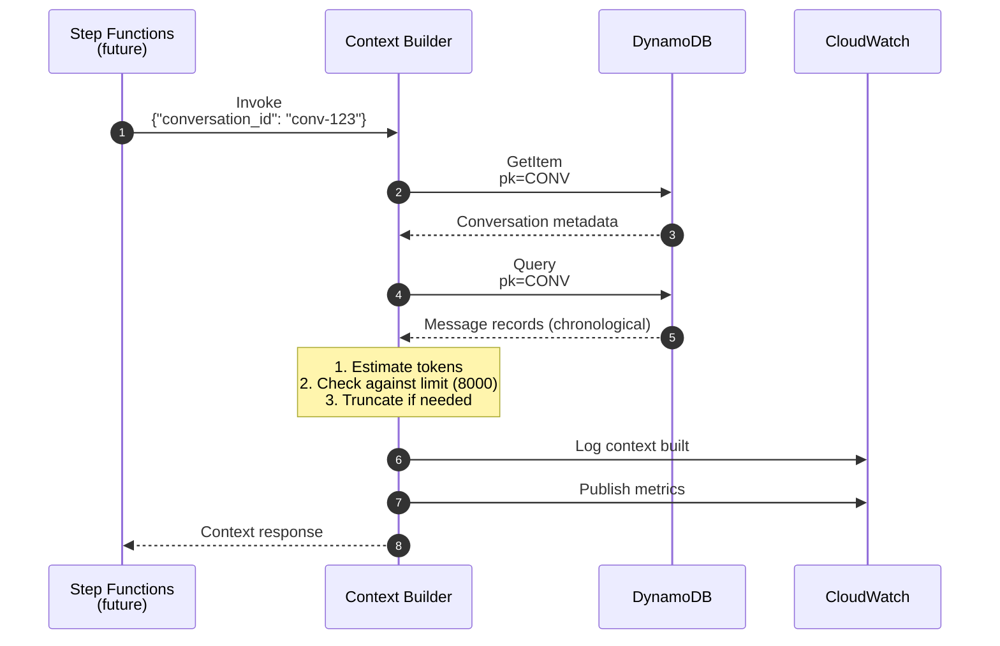

### Request/Response Format

**Request:**

```json
{
  "conversation_id": "conv-123",
  "include_system_prompt": true
}
```

**Response:**

```json
{
  "conversation_id": "conv-123",
  "context": {
    "conversation_id": "conv-123",
    "user_id": "user-456",
    "status": "ACTIVE",
    "last_intent": "question",
    "messages": [
      {
        "role": "USER",
        "content": "Hello, I need help",
        "timestamp": "2025-01-01T10:00:00Z"
      },
      {
        "role": "ASSISTANT",
        "content": "Hi! How can I help you today?",
        "timestamp": "2025-01-01T10:02:00Z"
      }
    ],
    "total_messages": 2,
    "estimated_tokens": 45,
    "is_truncated": false
  },
  "timestamp": "2025-01-01T10:05:00Z"
}
```

---

## DynamoDB Access Patterns

### Entity Relationships

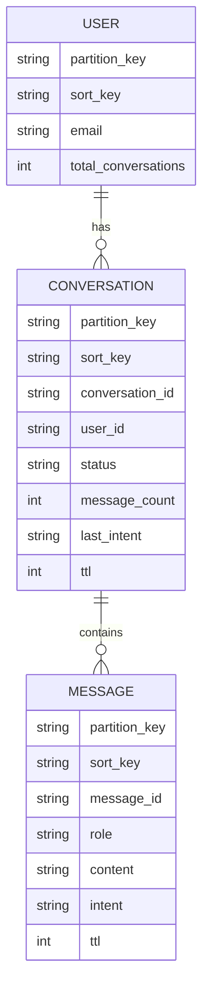

**Key Patterns:**

- `CONVERSATION`: partition_key = `CONV#{conversation_id}`, sort_key = `METADATA`
- `MESSAGE`: partition_key = `CONV#{conversation_id}`, sort_key = `MSG#{timestamp}#{message_id}`
- `USER`: partition_key = `USER#{user_id}`, sort_key = `PROFILE`

### Access Pattern Flows

#### Pattern 1: Get Conversation Metadata

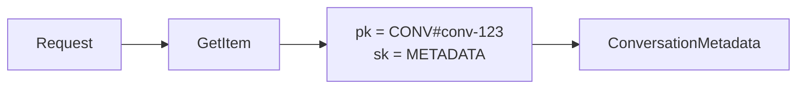

#### Pattern 2: Get Messages (Chronological)

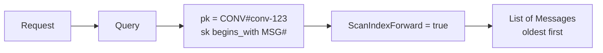

#### Pattern 3: Get User's Conversations

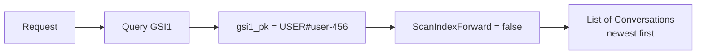

#### Pattern 4: Get Escalated Conversations

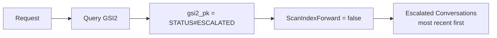

---

## Token Management Flow

### Context Window Management

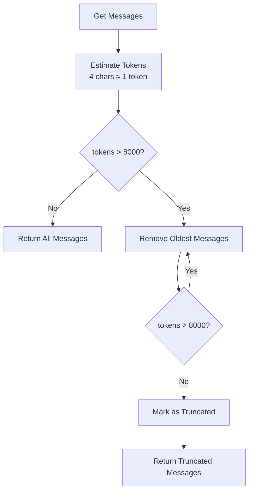

### Token Estimation Example

```markdown
Message: "Hello, I need help with my order"
Characters: 34
Estimated Tokens: 34 / 4 = 8.5 ≈ 9 tokens

Context Window Limit: 8000 tokens
Typical message: ~50 tokens
Max messages before truncation: ~160 messages
```

---

## Future: Step Functions Orchestration

### End-to-End Flow (Target State)

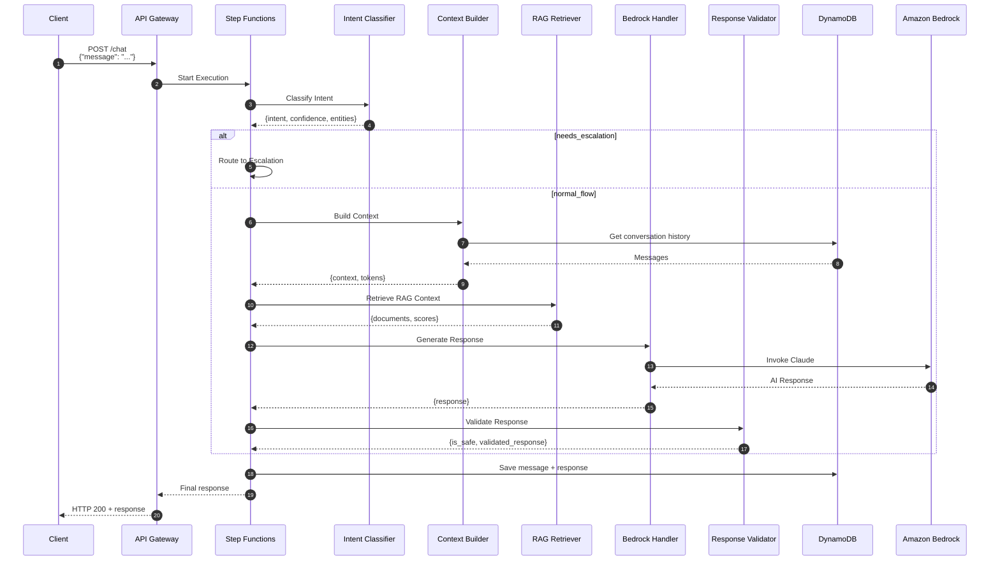

### State Machine Definition

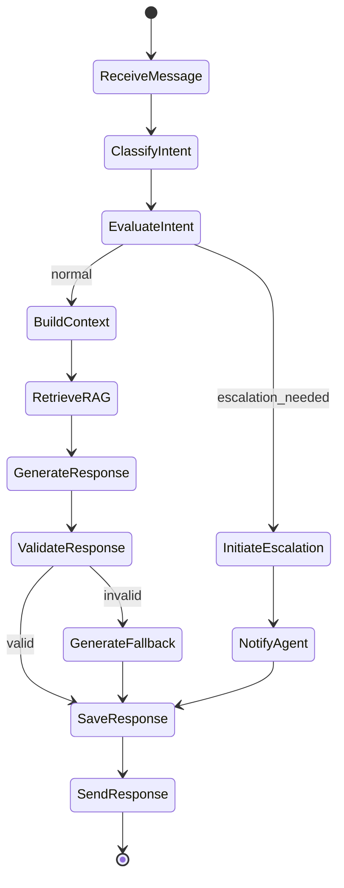

---

## Error Handling Flows

### Validation Error

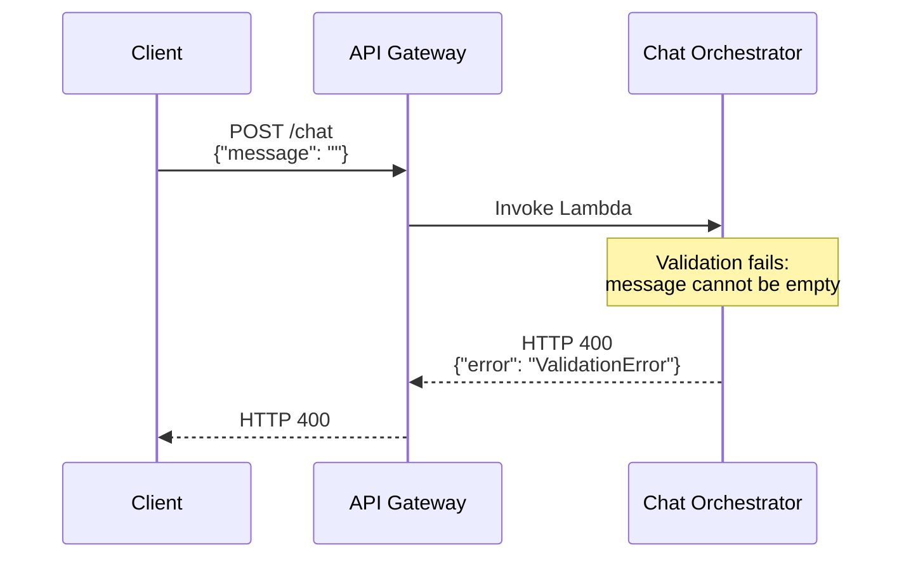

### RAG Retrieval Error (Non-Fatal)

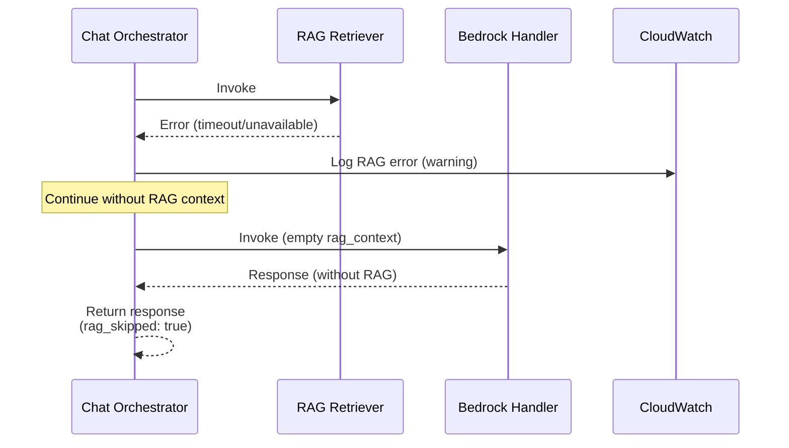

### Bedrock Error (Fatal)

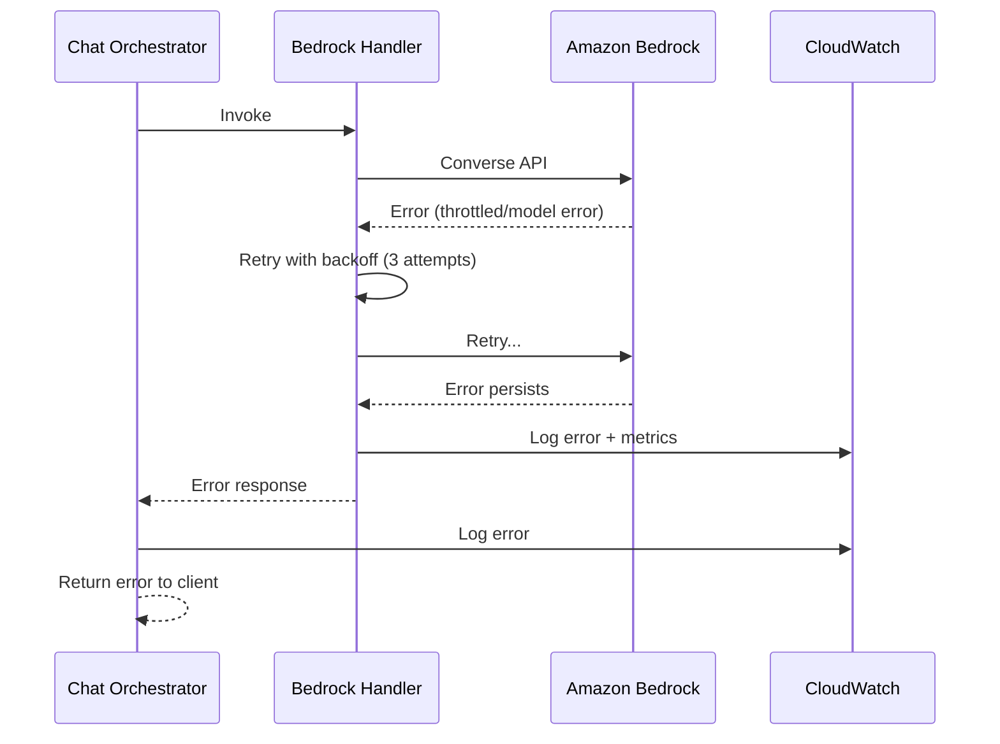

### DynamoDB Error

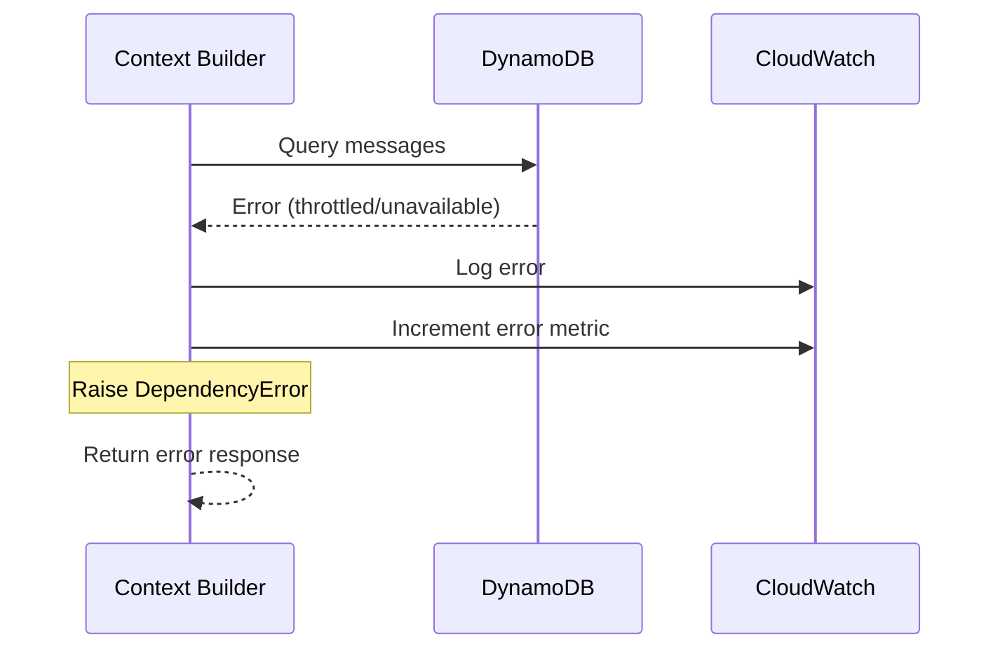

---

## Observability Data Flow

### Logging Flow

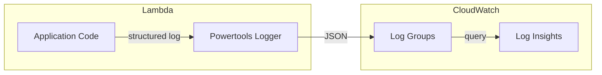

### Metrics Flow

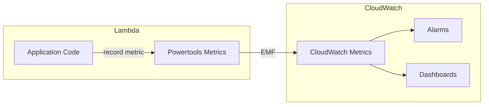

### Tracing Flow

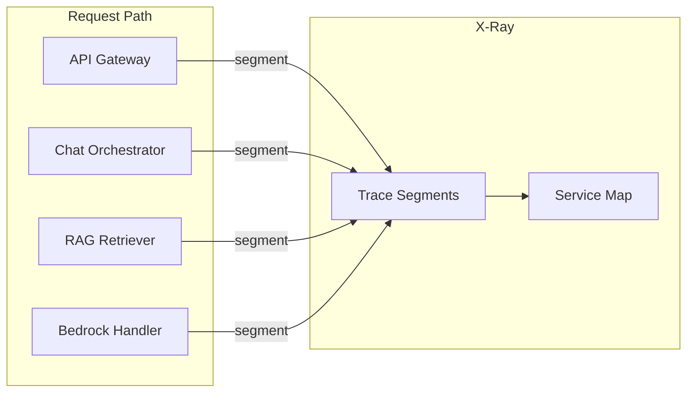

---

## Related Documentation

- [System Design](./system-design.md) — Overall architecture
- [ADR-008: DynamoDB Schema](../adr/ADR-008-dynamodb-schema-design.md) — Schema details
- [ADR-009: Bedrock Integration](../adr/ADR-009-bedrock-integration.md) — Bedrock design
- [ADR-010: Knowledge Base RAG](../adr/ADR-010-knowledge-base-rag.md) — RAG architecture
- [ADR-011: Orchestrator Pattern](../adr/ADR-011-orchestrator-pattern.md) — Orchestration design
- [Build & Deploy Architecture](../build-deploy-architecture.md) — Deployment flows
