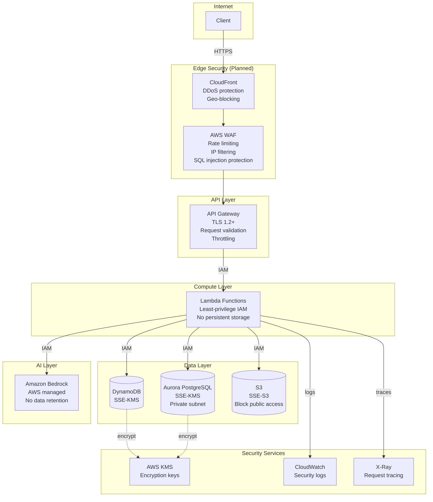
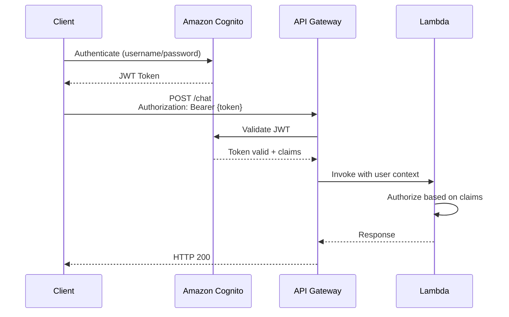
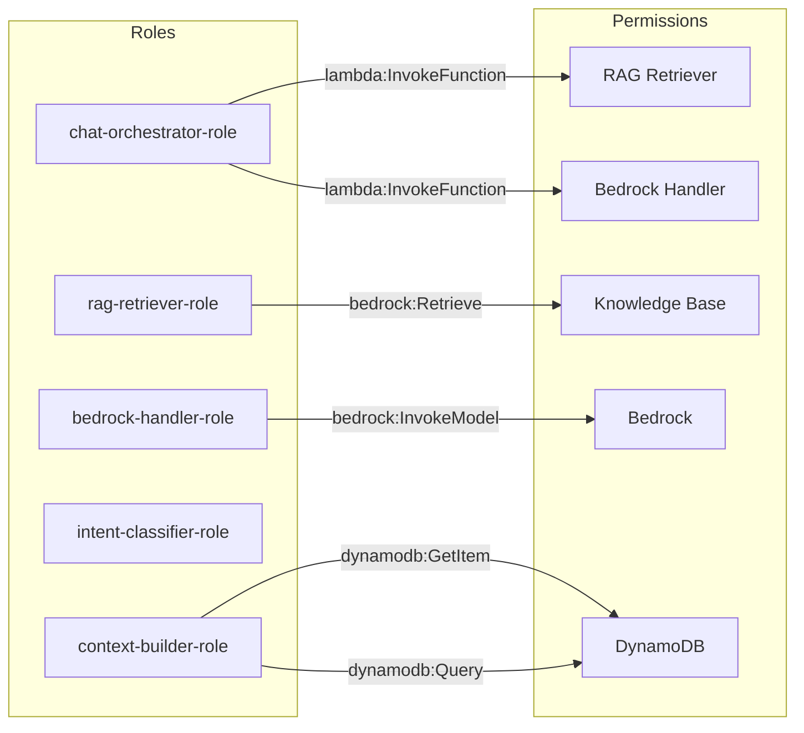
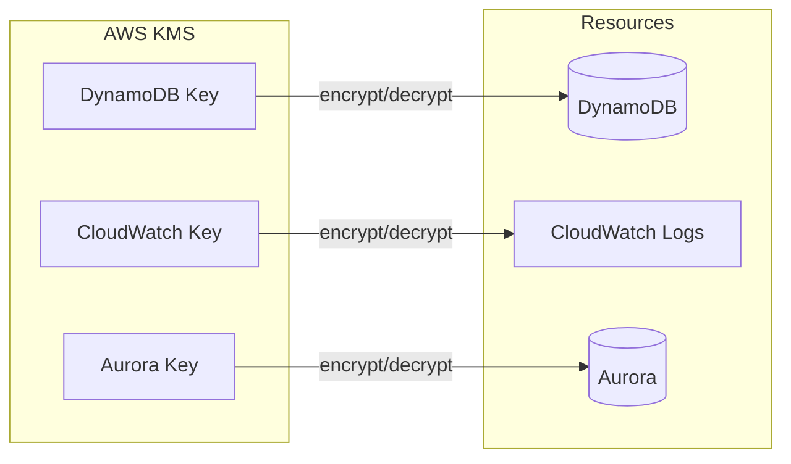
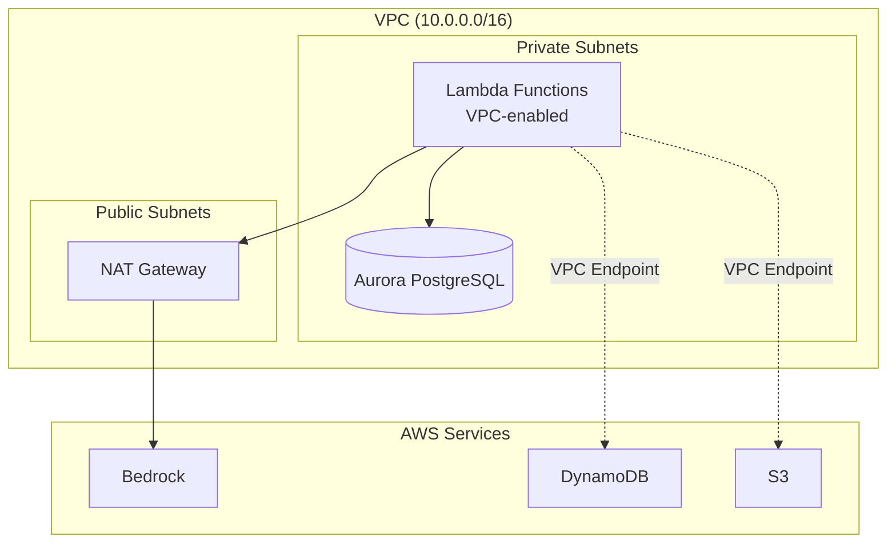
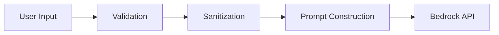
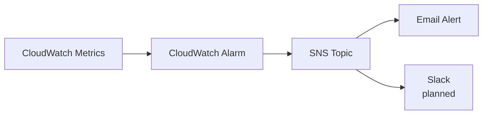

# Security Architecture

**Last Updated:** December 17, 2025
**Status:** Phase 2 Complete

---

## Overview

This document describes the security architecture for the AI Customer Service Bot, covering authentication, authorization, encryption, network security, and compliance considerations.

---

## Security Principles

1. **Defense in Depth** — Multiple layers of security controls
2. **Least Privilege** — Minimal permissions required for each component
3. **Encryption Everywhere** — Data encrypted at rest and in transit
4. **Zero Trust** — Verify explicitly, assume breach
5. **Audit Everything** — Comprehensive logging for security events
6. **Fail Secure** — Default to deny on errors

---

## Architecture Overview



---

## Security Controls Status

| Layer | Control | Status | Notes |
|-------|---------|--------|-------|
| **Edge** | AWS WAF | 📋 Planned | Rate limiting, geo-blocking |
| **Edge** | CloudFront | 📋 Planned | DDoS protection |
| **Transport** | TLS 1.2+ | ✅ Enabled | API Gateway enforced |
| **API** | Request validation | ✅ Enabled | JSON Schema validation |
| **API** | Throttling | ✅ Enabled | 100 burst / 50 per second |
| **API** | Authentication | 📋 Planned | Amazon Cognito |
| **API** | API Keys | 📋 Planned | For external integrations |
| **Compute** | Least-privilege IAM | ✅ Enabled | Per-function roles |
| **Compute** | VPC isolation | ✅ Partial | Aurora in private subnet |
| **Data** | DynamoDB encryption | ✅ Enabled | AWS managed KMS |
| **Data** | Aurora encryption | ✅ Enabled | AWS managed KMS |
| **Data** | S3 encryption | ✅ Enabled | SSE-S3 |
| **Data** | S3 public access block | ✅ Enabled | All public access blocked |
| **Logs** | CloudWatch encryption | ✅ Enabled | KMS encrypted |
| **Secrets** | Secrets Manager | 📋 Planned | For API keys, credentials |
| **Audit** | CloudTrail | 📋 Planned | API audit logging |

---

## Authentication & Authorization

### Current State (Phase 2)

API endpoints are currently **unauthenticated** for development purposes. Authorization is handled via:

- **IAM Roles** — Lambda execution roles with least-privilege policies
- **Resource Policies** — API Gateway resource policies (when enabled)
- **Tenant Isolation** — `tenant_id` parameter for logical data separation

### Target State (Production)



### Planned Authentication Methods

| Method | Use Case | Status |
|--------|----------|--------|
| Amazon Cognito | End users (web/mobile) | 📋 Planned |
| API Keys | External integrations | 📋 Planned |
| IAM Authentication | Internal services | 📋 Planned |

---

## IAM Security

### Lambda Execution Roles

Each Lambda function has a dedicated IAM role following least-privilege:



### Permission Boundaries

| Role | Allowed Actions | Denied Actions |
|------|-----------------|----------------|
| chat-orchestrator | `lambda:InvokeFunction` (specific ARNs) | All other Lambda actions |
| rag-retriever | `bedrock:Retrieve` | `bedrock:InvokeModel` |
| bedrock-handler | `bedrock:InvokeModel` | `bedrock:Retrieve`, `bedrock:CreateKnowledgeBase` |
| context-builder | `dynamodb:GetItem`, `dynamodb:Query` | `dynamodb:DeleteItem`, `dynamodb:PutItem` |

### IAM Best Practices Applied

- ✅ No wildcard (`*`) resources where possible
- ✅ Condition keys for additional restrictions
- ✅ Separate roles per Lambda function
- ✅ No inline policies (all managed policies)
- 📋 Permission boundaries (planned)
- 📋 Service control policies (planned for Organizations)

---

## Encryption

### Encryption at Rest

| Resource | Encryption Type | Key Management |
|----------|-----------------|----------------|
| DynamoDB | SSE-KMS | AWS managed key |
| Aurora PostgreSQL | SSE-KMS | AWS managed key |
| S3 (Knowledge Base) | SSE-S3 | Amazon S3 managed |
| CloudWatch Logs | SSE-KMS | AWS managed key |

### Encryption in Transit

| Connection | Protocol | Certificate |
|------------|----------|-------------|
| Client → API Gateway | TLS 1.2+ | AWS Certificate Manager |
| API Gateway → Lambda | Internal AWS | AWS managed |
| Lambda → DynamoDB | TLS | AWS managed |
| Lambda → Aurora | TLS | AWS managed |
| Lambda → Bedrock | TLS | AWS managed |

### Key Management



---

## Network Security

### VPC Architecture



### Security Groups

| Security Group | Inbound | Outbound |
|----------------|---------|----------|
| aurora-sg | 5432 from lambda-sg | None |
| lambda-sg | None | 443 (HTTPS), 5432 (PostgreSQL) |

### VPC Endpoints (Planned)

| Service | Endpoint Type | Status |
|---------|---------------|--------|
| DynamoDB | Gateway | 📋 Planned |
| S3 | Gateway | 📋 Planned |
| Bedrock | Interface | 📋 Planned |
| Secrets Manager | Interface | 📋 Planned |

---

## API Security

### Request Validation

API Gateway validates all requests against JSON schemas:

```json
{
  "$schema": "http://json-schema.org/draft-04/schema#",
  "type": "object",
  "required": ["message", "tenant_id"],
  "properties": {
    "message": {
      "type": "string",
      "minLength": 1,
      "maxLength": 10000
    },
    "tenant_id": {
      "type": "string",
      "minLength": 1,
      "maxLength": 100
    }
  }
}
```

### Throttling Configuration

| Setting | Value | Purpose |
|---------|-------|---------|
| Burst limit | 100 requests | Handle traffic spikes |
| Rate limit | 50 requests/second | Sustained throughput |
| Per-client throttling | 📋 Planned | Fair usage per API key |

### CORS Configuration

```yaml
Access-Control-Allow-Origin: '*'  # Restrict in production
Access-Control-Allow-Methods: 'POST, OPTIONS'
Access-Control-Allow-Headers: 'Content-Type, Authorization, X-Api-Key'
```

> ⚠️ **Production:** Replace `'*'` with specific allowed origins.

---

## Data Protection

### Sensitive Data Handling

| Data Type | Classification | Protection |
|-----------|----------------|------------|
| User messages | Confidential | Encrypted at rest, no logging of content |
| Tenant IDs | Internal | Logged for debugging |
| Conversation IDs | Internal | Logged for tracing |
| AI responses | Confidential | Encrypted at rest, no logging of content |
| RAG documents | Internal | Encrypted at rest |

### Data Retention

| Data | Retention Period | Deletion Method |
|------|------------------|-----------------|
| DynamoDB conversations | 30 days | TTL auto-delete |
| CloudWatch logs | 7 days | Retention policy |
| S3 documents | Indefinite | Manual deletion |
| X-Ray traces | 30 days | AWS managed |

### PII Considerations

- ❌ No PII stored in logs (message content excluded)
- ✅ Tenant isolation via `tenant_id`
- 📋 Data anonymization (planned)
- 📋 GDPR compliance features (planned)

---

## AI/ML Security

### Amazon Bedrock Security

| Control | Status | Notes |
|---------|--------|-------|
| Data not used for training | ✅ Enabled | AWS default for Bedrock |
| No data retention | ✅ Enabled | Requests not stored by AWS |
| Model access controls | ✅ Enabled | IAM-based |
| Prompt injection protection | 📋 Planned | Input sanitization |

### Prompt Security



**Planned Protections:**

- Input length limits (implemented)
- Prompt injection detection (planned)
- Output content filtering (planned - Response Validator)
- Rate limiting per user (planned)

---

## Logging & Monitoring

### Security Logging

| Log Type | Source | Retention | Purpose |
|----------|--------|-----------|---------|
| API access logs | API Gateway | 7 days | Request auditing |
| Lambda logs | CloudWatch | 7 days | Application debugging |
| X-Ray traces | X-Ray | 30 days | Request tracing |
| CloudTrail | AWS | 📋 Planned | API audit trail |

### Security Metrics

| Metric | Source | Alert Threshold |
|--------|--------|-----------------|
| 4XX errors | API Gateway | >10% of requests |
| 5XX errors | API Gateway | >1% of requests |
| Throttled requests | API Gateway | >50/minute |
| Lambda errors | CloudWatch | >5/minute |
| Unauthorized attempts | API Gateway | >10/minute |

### Alerting



---

## Incident Response

### Security Incident Categories

| Severity | Example | Response Time |
|----------|---------|---------------|
| Critical | Data breach, unauthorized access | Immediate |
| High | API abuse, DDoS attempt | 1 hour |
| Medium | Elevated error rates | 4 hours |
| Low | Minor policy violations | 24 hours |

### Response Procedures

1. **Detect** — CloudWatch alarms, log analysis
2. **Contain** — Disable API keys, block IPs (WAF)
3. **Investigate** — CloudTrail, X-Ray traces
4. **Remediate** — Patch vulnerabilities, rotate credentials
5. **Document** — Post-incident report

---

## Compliance Considerations

### Current Compliance

| Framework | Status | Notes |
|-----------|--------|-------|
| AWS Well-Architected | ✅ Partial | Security pillar review pending |
| SOC 2 | 📋 Planned | Requires additional controls |
| GDPR | 📋 Planned | Data residency, right to deletion |
| HIPAA | ❌ N/A | Not in scope |

### AWS Shared Responsibility

| AWS Responsibility | Customer Responsibility |
|--------------------|------------------------|
| Physical security | IAM policies |
| Network infrastructure | Security group rules |
| Hypervisor security | Application security |
| Managed service security | Data encryption keys |
| | Input validation |
| | Access control |

---

## Security Roadmap

### Short-term (Phase 3)

- [ ] Implement Amazon Cognito authentication
- [ ] Add Response Validator for content safety
- [ ] Enable AWS WAF with managed rules
- [ ] Add CloudTrail for API auditing

### Medium-term (Phase 4-5)

- [ ] Implement API keys for external integrations
- [ ] Add VPC endpoints for AWS services
- [ ] Enable AWS Config for compliance monitoring
- [ ] Implement secrets rotation via Secrets Manager

### Long-term

- [ ] SOC 2 compliance audit
- [ ] Penetration testing
- [ ] Bug bounty program
- [ ] Third-party security assessment

---

## Related Documentation

- [System Design](./system-design.md) — Overall architecture
- [Data Flow](./data-flow.md) — Data flow diagrams
- [ADR-007: API Gateway Integration](../adr/ADR-007-api-gateway-integration-and-request-validation.md)
- [ADR-008: DynamoDB Schema Design](../adr/ADR-008-dynamodb-schema-design.md)
