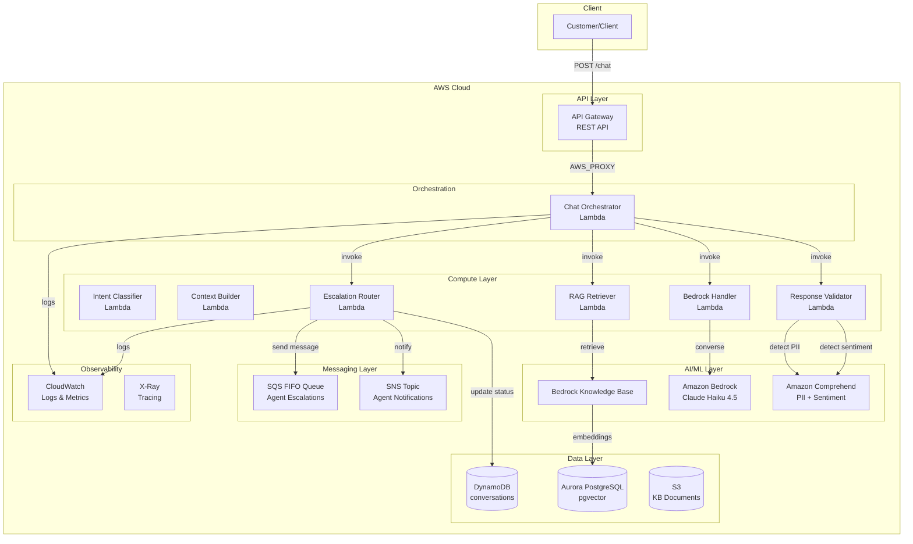
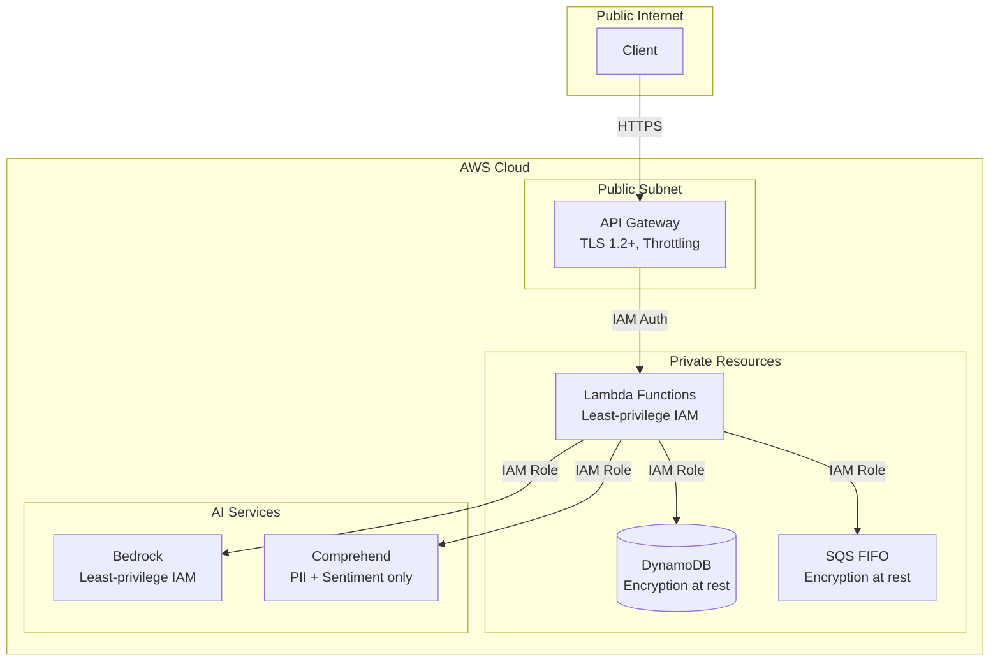

# System Design

**Last Updated:** December 30, 2025
**Status:** Phase 3.3 Complete

---

## Overview

The AI Customer Service Bot is a serverless, event-driven platform that provides intelligent customer support through natural language processing and AI-powered
responses using Amazon Bedrock and RAG (Retrieval-Augmented Generation),with comprehensive response validation including sentiment analysis, escalation scoring, and priority-based routing to human agents.

---

## Architecture Principles

1. **Serverless-First** — No servers to manage; pay only for what you use
2. **Event-Driven** — Loosely coupled components communicate via events
3. **Infrastructure as Code** — All infrastructure defined in Terraform
4. **Separation of Concerns** — Each Lambda has a single responsibility
5. **Observability by Default** — Logging, tracing, and metrics built-in
6. **Security in Depth** — Encryption, least-privilege IAM, input validation
7. **Stateless Handlers** — Lambdas are stateless for testability and reusability
8. **Fail-Safe Design** — Validation and routing layers fail open to avoid blocking customers

---

## Current Architecture (Phase 3.3)

### High-Level View



---

## Component Specifications

### Escalation Router Lambda

Routes escalated customer conversations to human agents based on priority scoring.

| Attribute | Value |
| ----------- | ------- |
| Runtime | Python 3.12 |
| Memory | 256 MB |
| Timeout | 30 seconds |
| Trigger | Direct invocation (from Orchestrator) |
| Layer | shared-layer |

**Responsibilities:**

- Classify escalation priority (CRITICAL, HIGH, NORMAL)
- Queue escalation messages to SQS FIFO
- Update conversation status in DynamoDB
- Send SNS notifications for high-priority escalations
- Generate priority-appropriate customer messages
- Track escalation metrics in CloudWatch

**Sub-Components:**

```bash
escalation-router/
├── handler.py           # Lambda entry point
├── service.py           # Routing orchestration layer
└── models.py            # Pydantic request/response models
```

**Configuration:**

| Variable | Default | Description |
| ---------- | --------- | ------------- |
| `ESCALATION_QUEUE_URL` | Required | SQS FIFO queue URL |
| `ESCALATION_NOTIFICATION_TOPIC_ARN` | Optional | SNS topic for alerts |
| `DYNAMODB_TABLE_NAME` | Required | Conversations table |
| `CRITICAL_THRESHOLD` | `0.90` | Score for CRITICAL priority |
| `HIGH_THRESHOLD` | `0.80` | Score for HIGH priority |

**Performance Characteristics:**

| Metric | Target | Notes |
| -------- | -------- | ------- |
| P50 Latency | < 100ms | Queue + optional notification |
| P99 Latency | < 500ms | With DynamoDB update |
| Cold Start | < 1s | Minimal dependencies |
| Memory | < 150MB | Typical usage |

**Priority Tiers:**

| Priority | Score Range | Estimated Wait | Use Case |
| ---------- | ------------- | ---------------- | ---------- |
| CRITICAL | ≥ 0.90 | < 2 minutes | Angry + explicit + urgent |
| HIGH | 0.80 - 0.89 | < 5 minutes | Explicit request or very negative |
| NORMAL | 0.70 - 0.79 | < 10 minutes | Moderate escalation signals |

### Response Validator Lambda

Validates all AI-generated responses before delivery to customers, ensuring safety and compliance.

| Attribute | Value |
| ----------- | ------- |
| Runtime | Python 3.12 |
| Memory | 512 MB |
| Timeout | 30 seconds |
| Trigger | Direct invocation (from Orchestrator) |
| Layer | shared-layer |

**Responsibilities:**

- Detect and handle PII in AI responses (Comprehend + regex)
- Filter profanity and inappropriate language
- Enforce response length constraints
- Add disclaimers for medical/legal/financial content
- Analyze user message sentiment via Comprehend
- Calculate escalation scores using 5-factor algorithm
- Return validated/modified responses with sentiment and escalation data

**Escalation Scoring Factors:**

| Factor | Weight | Description |
| -------- | -------- | ------------- |
| Explicit Intent | 0.35 | User explicitly requests human agent |
| Negative Sentiment | 0.25 | Comprehend negative sentiment score |
| Urgency | 0.20 | High/medium/low urgency classification |
| Repeated Question | 0.15 | Same intent asked multiple times |
| Low Confidence | 0.05 | Intent classifier confidence below threshold |

### Chat Orchestrator Lambda

Orchestrates the complete chat flow, coordinating all downstream services.

| Attribute | Value |
| ----------- | ------- |
| Runtime | Python 3.12 |
| Memory | 512 MB |
| Timeout | 29 seconds |
| Trigger | API Gateway (sync) |
| Layer | shared-layer |

**Responsibilities:**

- Coordinate chat flow between RAG, Bedrock, Validator, and Router
- Generate conversation IDs when not provided
- Aggregate latency metrics (RAG, Bedrock, validation, escalation, total)
- Invoke Escalation Router when threshold exceeded
- Return unified response format with all metadata

### SQS FIFO Queue

Reliable message delivery for escalated conversations.

| Attribute | Value |
| ----------- | ------- |
| Type | FIFO |
| Deduplication | Content-based (escalation_id) |
| Message Groups | priority-critical, priority-high, priority-normal |
| Visibility Timeout | 30 seconds |
| Retention | 14 days |

**Message Groups:**

- `priority-critical` — Processed first by agents
- `priority-high` — Second priority
- `priority-normal` — Standard queue

---

## Security Architecture



### Security Controls

| Layer | Control | Status |
| ------- | --------- | -------- |
| Transport | TLS 1.2+ | ✅ Enabled |
| API | Request validation | ✅ Enabled |
| API | Throttling | ✅ Enabled (100/50) |
| Compute | Least-privilege IAM | ✅ Enabled |
| Response | PII detection & blocking | ✅ Enabled |
| Response | Profanity filtering | ✅ Enabled |
| Response | Sentiment analysis | ✅ Enabled |
| Response | Escalation scoring | ✅ Enabled |
| Escalation | SQS FIFO encryption | ✅ Enabled |
| Data | DynamoDB encryption at rest | ✅ Enabled (KMS) |

---

## Observability Architecture

### Metrics Collected

| Metric | Source | Purpose |
| -------- | -------- | --------- |
| EscalationRouted | Escalation Router | Conversations routed |
| EscalationPriority_CRITICAL | Escalation Router | Critical escalations |
| EscalationPriority_HIGH | Escalation Router | High priority |
| EscalationPriority_NORMAL | Escalation Router | Normal priority |
| EscalationQueueLatency | Escalation Router | Queue time |
| EscalationNotificationSent | Escalation Router | SNS alerts sent |
| EscalationError | Escalation Router | Routing failures |
| EscalationTriggered | Response Validator | Threshold exceeded |
| SentimentAnalysisRequests | Response Validator | Sentiment calls |
| ValidationCount | Response Validator | Total validations |
| ValidationBlocked | Response Validator | Blocked responses |

### Alarms

| Alarm | Threshold | Severity |
| -------- | ----------- | ---------- |
| Lambda Error Rate | > 5% in 5 min | High |
| Lambda Throttling | > 0 in 1 min | High |
| Escalation Error Rate | > 10% in 5 min | High |
| Escalation Rate | > 30% in 15 min | Medium |
| Critical Escalation Spike | > 10 in 5 min | High |

---

## Related Documentation

- [Data Flow](./data-flow.md) — Detailed data flow diagrams
- [ADR-012: Response Validation Strategy](../adr/ADR-012-response-validation.md)
- [ADR-013: Sentiment Analysis & Escalation](../adr/ADR-013-sentiment-escalation.md)
- [ADR-014: Escalation Router](../adr/ADR-014-escalation-router.md)
