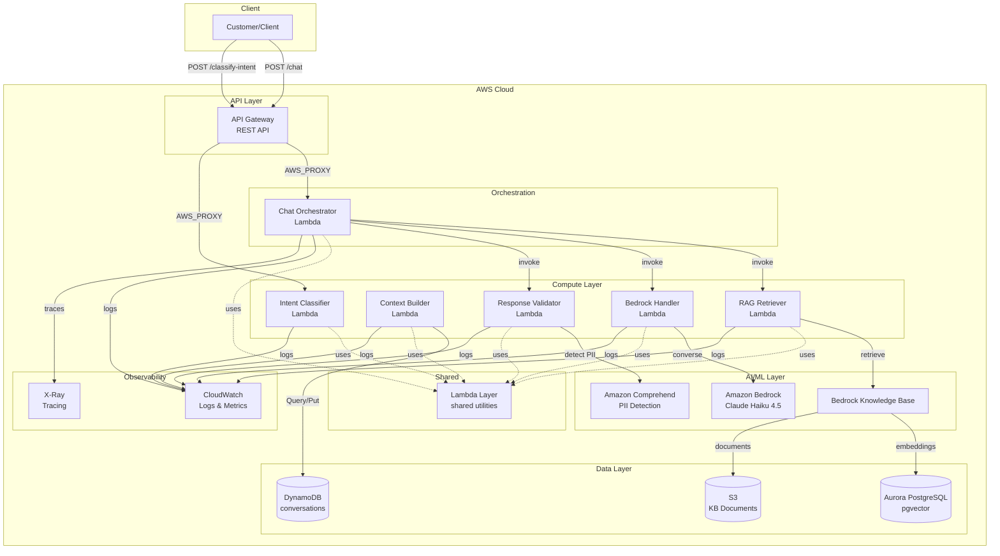
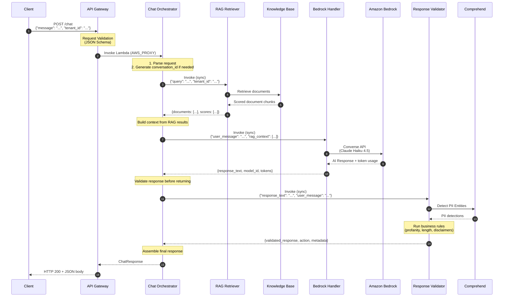
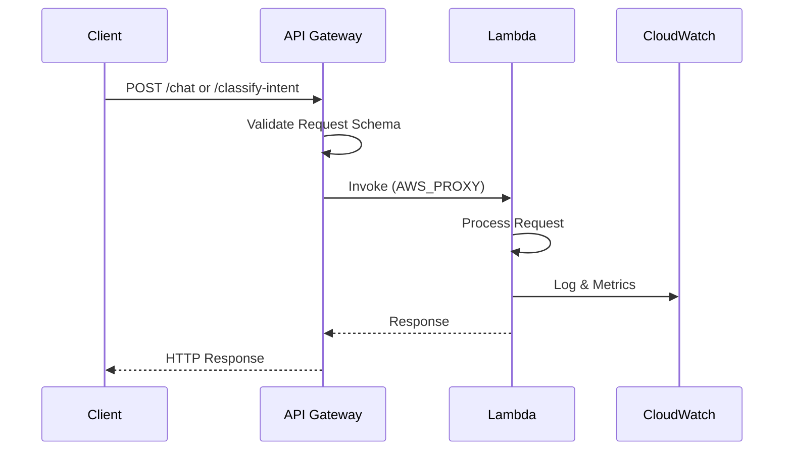
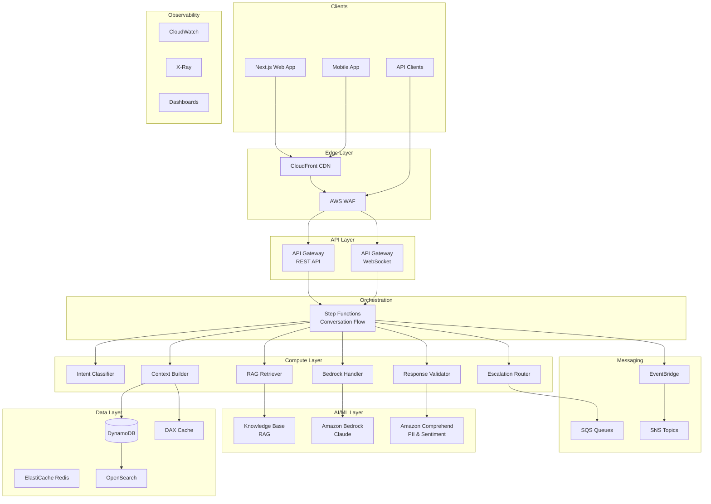
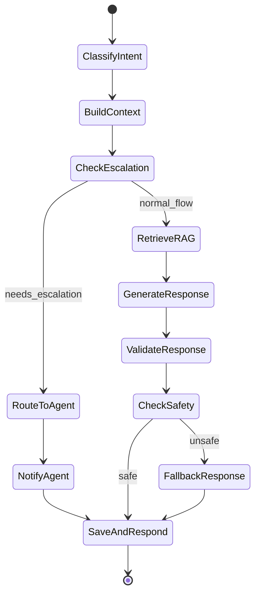
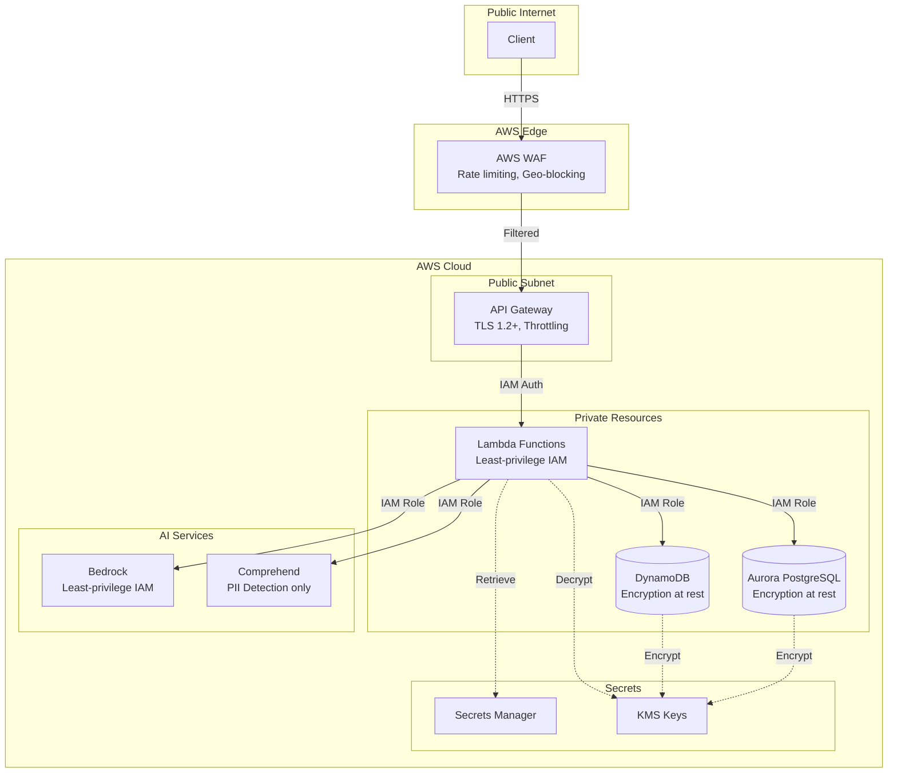
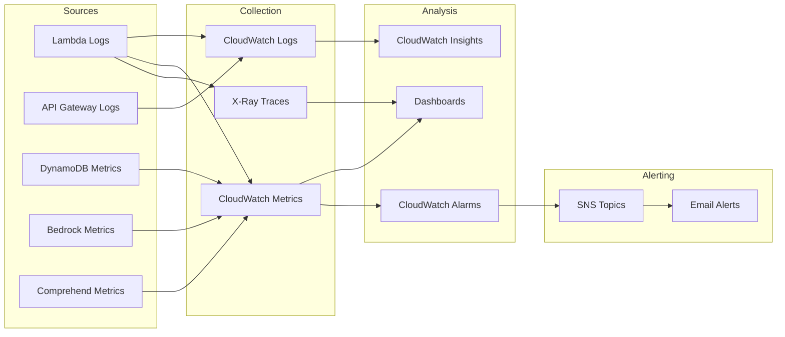
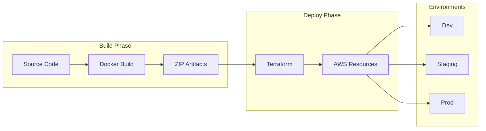

# System Design

**Last Updated:** December 27th, 2025
**Status:** Phase 3.1 Complete

---

## Overview

The AI Customer Service Bot is a serverless, event-driven platform that provides intelligent customer support through natural language processing and AI-powered responses
using Amazon Bedrock and RAG (Retrieval-Augmented Generation), with comprehensive response validation for safety and compliance.

---

## Architecture Principles

1. **Serverless-First** — No servers to manage; pay only for what you use
2. **Event-Driven** — Loosely coupled components communicate via events
3. **Infrastructure as Code** — All infrastructure defined in Terraform
4. **Separation of Concerns** — Each Lambda has a single responsibility
5. **Observability by Default** — Logging, tracing, and metrics built-in
6. **Security in Depth** — Encryption, least-privilege IAM, input validation
7. **Stateless Handlers** — Lambdas are stateless for testability and reusability
8. **Fail-Safe Design** — Validation layer fails open to avoid blocking customers

---

## Current Architecture (Phase 3.1)

### High-Level View



### Chat Flow Detail



### Component Details

```mermaid
flowchart LR
    subgraph Chat Orchestrator
        CO_IN[Request] --> CO_VAL[Validate Input]
        CO_VAL --> CO_RAG[Invoke RAG]
        CO_RAG --> CO_CTX[Build Context]
        CO_CTX --> CO_BED[Invoke Bedrock]
        CO_BED --> CO_VALID[Invoke Validator]
        CO_VALID --> CO_OUT[Response]
    end

    subgraph RAG Retriever
        RR_IN[Query] --> RR_KB[Query Knowledge Base]
        RR_KB --> RR_FILTER[Filter by Score]
        RR_FILTER --> RR_OUT[Documents]
    end

    subgraph Bedrock Handler
        BH_IN[Request] --> BH_PROMPT[Build Prompt]
        BH_PROMPT --> BH_INVOKE[Invoke Model]
        BH_INVOKE --> BH_OUT[Response]
    end

    subgraph Response Validator
        RV_IN[Response] --> RV_PII[PII Detection]
        RV_PII --> RV_RULES[Business Rules]
        RV_RULES --> RV_LENGTH[Length Check]
        RV_LENGTH --> RV_ACTION[Determine Action]
        RV_ACTION --> RV_OUT[Validated Response]
    end

    subgraph Intent Classifier
        IC_IN[Request] --> IC_VAL[Validate Input]
        IC_VAL --> IC_CLASS[Classify Intent]
        IC_CLASS --> IC_ENT[Extract Entities]
        IC_ENT --> IC_OUT[Response]
    end

    subgraph Context Builder
        CB_IN[Request] --> CB_META[Get Metadata]
        CB_META --> CB_MSG[Get Messages]
        CB_MSG --> CB_TOK[Estimate Tokens]
        CB_TOK --> CB_TRUNC[Truncate if Needed]
        CB_TRUNC --> CB_OUT[Context Response]
    end
```



### API Gateway Integration



---

## Response Validation Layer

### Overview

The Response Validator is a Lambda function that validates all AI-generated responses before delivery to customers.
It acts as a safety guardrail ensuring responses meet quality, safety, and compliance requirements.

### Position in Architecture

```bash
┌─────────────────────────────────────────────────────────────────────────────┐
│                              Chat Orchestrator                               │
├─────────────────────────────────────────────────────────────────────────────┤
│                                                                             │
│   ┌─────────────┐    ┌─────────────┐    ┌──────────────────┐               │
│   │    RAG      │───▶│   Bedrock   │───▶│    Response      │───▶ Customer  │
│   │  Retriever  │    │   Handler   │    │    Validator     │               │
│   └─────────────┘    └─────────────┘    └──────────────────┘               │
│                                                │                            │
│                                         ┌──────┴──────┐                     │
│                                         ▼             ▼                     │
│                                   ┌─────────┐   ┌──────────┐               │
│                                   │ Amazon  │   │ Business │               │
│                                   │Comprehend│   │  Rules   │               │
│                                   └─────────┘   └──────────┘               │
│                                                                             │
└─────────────────────────────────────────────────────────────────────────────┘
```

### Validation Pipeline

The validator runs checks in priority order:

| Priority | Check | Action on Failure |
| ---------- | ------- | ------------------- |
| P5 | Profanity | BLOCK |
| P10 | Length | BLOCK (too short) or MODIFY (truncate) |
| P20 | Topic Restrictions | MODIFY (add disclaimer) |
| P30 | PII Detection | BLOCK (SSN/CC) or WARN (other) |

### PII Detection Strategy

**Hybrid Approach:**

1. **Amazon Comprehend** — ML-based detection for names, addresses, emails
2. **Regex Patterns** — Deterministic detection for SSN, credit cards, order IDs

**PII Actions:**

| PII Type | Action | Rationale |
| ---------- | -------- | ----------- |
| SSN | BLOCK | Critical - never expose |
| Credit Card | BLOCK | Critical - PCI compliance |
| Phone | REDACT | Moderate - mask in logs |
| Name | WARN | Low risk - log only |
| Order ID | ALLOW | Business identifier |

### Validation Actions

| Action | Description |
| -------- | ------------- |
| `PASS` | Response is valid, no changes needed |
| `MODIFY` | Response modified (truncated, disclaimer added) |
| `BLOCK` | Response blocked, fallback message used |
| `WARN` | Response passed with warnings logged |

### Error Handling (Fail-Open Design)

When validation errors occur, the system returns the original response with a WARN action rather than blocking the customer interaction.

```python
# Fail-open behavior
try:
    result = validator.validate(response)
except Exception:
    return ValidationResponse(
        is_valid=True,
        action=ValidationAction.WARN,
        validated_response=original_response,
        metadata={"fallback_reason": "validation_error"}
    )
```

---

## Target Architecture (Full Implementation)

### Complete System View



### Step Functions Workflow (Target State)



---

## Component Specifications

### Response Validator Lambda

| Attribute | Value |
| ----------- | ------- |
| Runtime | Python 3.12 |
| Memory | 512 MB |
| Timeout | 30 seconds |
| Trigger | Direct invocation (from Orchestrator) |
| Layer | shared-layer |

**Responsibilities:**

- Detect and handle PII in AI responses (Comprehend + regex)
- Filter profanity and inappropriate language
- Enforce response length constraints
- Add disclaimers for medical/legal/financial content
- Calculate escalation scores
- Return validated/modified responses

**Sub-Components:**

```bash
response-validator/
├── handler.py          # Lambda entry point, error handling
├── service.py          # Orchestration layer, fail-open logic
├── pii_detector.py     # PII detection (Comprehend + regex)
├── rules.py            # Business rules engine
└── models.py           # Pydantic request/response models
```

**Configuration:**

| Variable | Default | Description |
| ---------- | --------- | ------------- |
| `ENABLE_PII_DETECTION` | `true` | Enable PII detection via Comprehend |
| `ENABLE_PROFANITY_CHECK` | `true` | Enable profanity filtering |
| `ENABLE_BUSINESS_RULES` | `true` | Enable topic restriction rules |
| `ENABLE_LENGTH_CHECK` | `true` | Enable length validation |
| `MIN_RESPONSE_LENGTH` | `20` | Minimum response length (chars) |
| `MAX_RESPONSE_LENGTH` | `2000` | Maximum response length (chars) |
| `TRUNCATE_LONG_RESPONSES` | `true` | Auto-truncate long responses |
| `FAIL_OPEN_ON_ERROR` | `false` | Return original on validation errors |

**Performance Characteristics:**

| Metric | Target | Notes |
| -------- | -------- | ------- |
| P50 Latency | < 200ms | Without Comprehend |
| P99 Latency | < 800ms | With Comprehend call |
| Cold Start | < 2s | With provisioned concurrency |
| Memory | < 256MB | Typical usage |

### Chat Orchestrator Lambda

| Attribute | Value |
| ----------- | ------- |
| Runtime | Python 3.12 |
| Memory | 512 MB |
| Timeout | 29 seconds |
| Trigger | API Gateway (sync) |
| Layer | shared-layer |

**Responsibilities:**

- Coordinate chat flow between RAG, Bedrock, and Validator
- Generate conversation IDs when not provided
- Aggregate latency metrics (RAG, Bedrock, validation, total)
- Handle errors from downstream services
- Return unified response format with validation metadata

**Endpoints:**

- `POST /chat` — Full chat flow with RAG-enhanced, validated AI responses

### RAG Retriever Lambda

| Attribute | Value |
| ----------- | ------- |
| Runtime | Python 3.12 |
| Memory | 256 MB |
| Timeout | 30 seconds |
| Trigger | Direct invocation (from Orchestrator) |
| Layer | shared-layer |

**Responsibilities:**

- Query Bedrock Knowledge Base
- Semantic search for relevant documents
- Filter results by relevance score
- Return scored document chunks with source attribution

**Configuration:**

- Default `top_k`: 5 documents
- Default `min_score`: 0.5
- Configurable per request

### Bedrock Handler Lambda

| Attribute | Value |
| ----------- | ------- |
| Runtime | Python 3.12 |
| Memory | 512 MB |
| Timeout | 30 seconds |
| Trigger | Direct invocation (from Orchestrator) |
| Layer | shared-layer |

**Responsibilities:**

- Invoke Amazon Bedrock Claude models
- Build prompts with system instructions
- Inject RAG context into prompts
- Track token usage metrics
- Handle model errors and throttling

**Model Configuration:**

- Model: `us.anthropic.claude-haiku-4-5-20251001-v1:0`
- Default max_tokens: 1024
- Default temperature: 0.7

### Knowledge Base

| Attribute | Value |
| ----------- | ------- |
| Type | Bedrock Knowledge Base |
| Vector Store | Aurora PostgreSQL Serverless v2 |
| Embedding Model | amazon.titan-embed-text-v2:0 |
| Chunking | Semantic chunking |

**Components:**

- **S3 Bucket:** Stores source documents (FAQs, policies)
- **Aurora PostgreSQL:** Vector storage with pgvector extension
- **Bedrock KB:** Manages embeddings and retrieval

**Document Types:**

- FAQ markdown files
- Policy documents
- Product documentation

### Intent Classifier Lambda

| Attribute | Value |
| ----------- | ------- |
| Runtime | Python 3.12 |
| Memory | 256 MB |
| Timeout | 30 seconds |
| Trigger | API Gateway (sync) |
| Layer | shared-layer |

**Responsibilities:**

- Classify customer messages into intent categories
- Extract entities (order IDs, products, sentiment)
- Calculate confidence scores
- Flag messages requiring escalation

**Intent Types:**

- `greeting` — Greetings and farewells
- `question` — General inquiries
- `complaint` — Customer complaints
- `request` — Action requests
- `escalation` — Human agent requests
- `shipping` — Delivery inquiries
- `technical_support` — Technical issues

### Context Builder Lambda

| Attribute | Value |
| ----------- | ------- |
| Runtime | Python 3.12 |
| Memory | 512 MB |
| Timeout | 30 seconds |
| Trigger | Direct invocation / Step Functions |
| Layer | shared-layer |

**Responsibilities:**

- Retrieve conversation history from DynamoDB
- Estimate token usage (4 chars ≈ 1 token)
- Manage context window (8000 tokens max)
- Truncate older messages when limits exceeded
- Return structured context for Bedrock

### DynamoDB Table

| Attribute | Value |
| ----------- | ------- |
| Table Name | conversations |
| Billing Mode | On-demand (PAY_PER_REQUEST) |
| Primary Key | pk (HASH), sk (RANGE) |
| TTL | 30 days |
| Streams | Enabled (NEW_AND_OLD_IMAGES) |

**Indexes:**

- **GSI1:** User queries (`gsi1_pk`, `gsi1_sk`)
- **GSI2:** Status queries (`gsi2_pk`, `gsi2_sk`)

See [ADR-008](../adr/ADR-008-dynamodb-schema-design.md) for schema details.

### Shared Lambda Layer

| Attribute | Value |
| ----------- | ------- |
| Runtime | Python 3.12 |
| Size | ~15 MB |
| Build | Docker (Amazon Linux 2) |

**Contents:**

- AWS Lambda Powertools (logging, tracing, metrics)
- Pydantic (data validation)
- boto3 (AWS SDK)
- tenacity (retry logic)
- Custom shared code (`shared/`)

---

## Security Architecture



### Security Controls

| Layer | Control | Status |
| ------- | --------- | -------- |
| Edge | AWS WAF | 📋 Planned |
| Transport | TLS 1.2+ | ✅ Enabled |
| API | Request validation | ✅ Enabled |
| API | Throttling | ✅ Enabled (100/50) |
| API | Authentication | 📋 Planned (Cognito) |
| Compute | Least-privilege IAM | ✅ Enabled |
| AI | Comprehend PII only | ✅ Enabled |
| Response | PII detection & blocking | ✅ Enabled |
| Response | Profanity filtering | ✅ Enabled |
| Response | Content safety rules | ✅ Enabled |
| Data | DynamoDB encryption at rest | ✅ Enabled (KMS) |
| Data | Aurora encryption at rest | ✅ Enabled (KMS) |
| Data | S3 encryption | ✅ Enabled (SSE-S3) |
| Logs | Encryption | ✅ Enabled (KMS) |
| Logs | PII masked before logging | ✅ Enabled |
| Secrets | Secrets Manager | 📋 Planned |

---

## Observability Architecture



### Metrics Collected

| Metric | Source | Purpose |
| -------- | -------- | --------- |
| Invocations | Lambda | Usage tracking |
| Duration | Lambda | Performance |
| Errors | Lambda | Reliability |
| Throttles | Lambda/API GW | Capacity |
| 4XX/5XX | API Gateway | Error rates |
| Latency | API Gateway | User experience |
| ReadThrottleEvents | DynamoDB | Capacity |
| WriteThrottleEvents | DynamoDB | Capacity |
| Intent counts | Intent Classifier | Business metrics |
| BedrockInvocations | Bedrock Handler | AI usage |
| BedrockInputTokens | Bedrock Handler | Token tracking |
| BedrockOutputTokens | Bedrock Handler | Token tracking |
| BedrockLatency | Bedrock Handler | AI performance |
| DocumentsRetrieved | RAG Retriever | RAG effectiveness |
| RetrievalLatency | RAG Retriever | RAG performance |
| AverageRelevanceScore | RAG Retriever | RAG quality |
| ValidationCount | Response Validator | Total validations |
| ValidationBlocked | Response Validator | Blocked responses |
| ValidationModified | Response Validator | Modified responses |
| PIIDetected | Response Validator | PII detection events |
| ValidationLatency | Response Validator | Processing time |
| ComprehendCalls | Response Validator | Comprehend API calls |
| FallbackUsed | Response Validator | Fallback activations |

### Alarms

| Alarm | Threshold | Severity |
| -------- | ----------- | ---------- |
| Lambda Error Rate | > 5% in 5 min | High |
| Lambda P99 Latency | > 5 seconds | Medium |
| Lambda Throttling | > 0 in 1 min | High |
| DynamoDB Throttling | > 0 in 1 min | High |
| Bedrock Throttling | > 0 in 5 min | Medium |
| Validation Block Rate | > 10% in 15 min | Medium |
| PII Detection Spike | > 50 in 5 min | High |

---

## Deployment Architecture

See [Build & Deploy Architecture](../build-deploy-architecture.md) for detailed deployment pipeline documentation.

### Summary



---

## Related Documentation

- [Data Flow](./data-flow.md) — Detailed data flow diagrams
- [Build & Deploy Architecture](../build-deploy-architecture.md) — CI/CD pipeline
- [ADR-007: API Gateway Integration](../adr/ADR-007-api-gateway-integration-and-request-validation.md)
- [ADR-008: DynamoDB Schema Design](../adr/ADR-008-dynamodb-schema-design.md)
- [ADR-009: Bedrock Integration](../adr/ADR-009-bedrock-integration.md)
- [ADR-010: Knowledge Base RAG](../adr/ADR-010-knowledge-base-rag.md)
- [ADR-011: Orchestrator Pattern](../adr/ADR-011-orchestrator-pattern.md)
- [ADR-012: Response Validation Strategy](../adr/ADR-012-response-validation.md)
